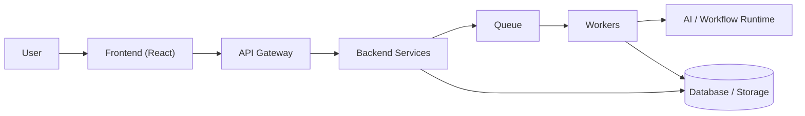

---

# 01 — Project Overview

## Problem Statement

Building an AI-augmented automation (workflow) is currently split across disconnected tools: a visual builder for the graph, a separate chat interface for AI assistance, ad-hoc scripts for execution, and no structured way to share or monetize completed work with other users. Nexora unifies these into a single platform where workflows are created visually or via natural language, executed reliably at scale, collaborated on in real time by an organization's members, and optionally published to a marketplace for reuse.

## Product Concept

Nexora allows an authenticated user, acting within an **organization**, to:

- Create a **project** and, within it, one or more **workflows**.
- Build a workflow visually as a directed acyclic graph (DAG) of **nodes** connected by **edges**.
- Configure each node (inputs, parameters, connected external services).
- Run a workflow and inspect per-node outputs and execution history.
- Ask an **AI agent** to create or modify the workflow using natural language; the agent proposes structured, schema-validated actions rather than editing state directly.
- Collaborate with other organization members on the same workflow in real time, seeing presence and live changes.
- Save and version workflows, and roll back to a previous version.
- **Publish** a workflow to the marketplace, and **reuse or acquire** workflows published by others.
- Manage organization membership and role-based permissions.

## Non-Goals for the Graduation Project

Nexora does not attempt to be a general-purpose enterprise iPaaS. The following are explicitly out of scope for the academic delivery (see [[22 - MVP vs Future Work]] for the full boundary):

- Fully autonomous, unsupervised multi-step AI agents.
- Production-grade payment processing.
- Multi-region, globally distributed deployment.
- Conflict-free replicated collaborative editing (CRDT/OT).

## System at a Glance

See [[03 - System Architecture]] for the complete architecture and [[06 - Workflow Engine]] and [[07 - AI Architecture]] for the two subsystems that give the project its technical depth.

## Document Index

This overview is the entry point into the full documentation set; see the [[README|documentation homepage]] for the complete map.

---

# 02 — Requirements

## Functional Requirements

| ID | Requirement | MVP? |
|---|---|---|
| FR-1 | Users can register, authenticate, and manage a profile | Yes |
| FR-2 | Users can create and join organizations | Yes |
| FR-3 | Organization admins can invite members and assign roles | Yes |
| FR-4 | Users can create projects within an organization | Yes |
| FR-5 | Users can create workflows within a project | Yes |
| FR-6 | Users can add, configure, connect, and remove workflow nodes | Yes |
| FR-7 | Users can execute a workflow and view per-node outputs | Yes |
| FR-8 | Workflow executions are versioned and their history is retained | Yes |
| FR-9 | Users can invoke an AI agent to create or modify a workflow via natural language | Yes |
| FR-10 | AI-proposed actions are schema-validated and authorized before execution | Yes |
| FR-11 | Multiple users can edit the same workflow concurrently with visible presence | Yes |
| FR-12 | Workflow operations from one collaborator are broadcast to others in real time | Yes |
| FR-13 | Users can publish a workflow version to a marketplace listing | Yes |
| FR-14 | Users can browse, acquire, and reuse marketplace workflows | Yes |
| FR-15 | Failed executions are retried with backoff and moved to a dead-letter queue after exhausting retries | Yes |
| FR-16 | Users can comment on workflows | Stretch |
| FR-17 | Marketplace purchases are processed through a real payment provider | Stretch |
| FR-18 | Concurrent edits are merged via CRDT/OT instead of server-ordered sequencing | Stretch |

## Non-Functional Requirements

| Category | Requirement |
|---|---|
| Security | All API access is authenticated; all resource access is authorized against organization/role membership |
| Multi-Tenancy | One organization's data must never be visible to another organization |
| Reliability | Workflow execution failures must not silently lose work; retries and a dead-letter queue are mandatory |
| Scalability | API and worker components must scale horizontally and independently |
| Observability | The system must expose metrics, structured logs, and health endpoints sufficient to diagnose a production incident |
| Testability | Core business logic (validation, authorization, workflow execution, AI action handling) must be covered by automated tests |
| Maintainability | Business-critical validation and authorization must live in the backend, never solely in the frontend |

## Actors

| Actor | Description |
|---|---|
| End User | Authenticated individual who creates and runs workflows |
| Organization Admin | User with elevated permissions over an organization's members and settings |
| Collaborator | Any organization member with edit access to a shared workflow |
| AI Agent | System-internal actor that proposes structured workflow actions; never a privileged actor — every action it proposes is authorized as if performed by the requesting user |
| Marketplace Consumer | User acquiring/reusing a workflow published by another organization |

## Constraints

- Delivery window is a single academic year with an 8-person team (see [[24 - Team Responsibilities]]).
- The AI component must not execute arbitrary code or directly mutate the database; see [[07 - AI Architecture]].
- Cloud provider is not fixed in advance; infrastructure is described in provider-agnostic terms where practical (see [[11 - DevOps Architecture]]).

> [!note] Decision Pending
> The specific LLM provider (e.g., a hosted API vs. a self-hosted model) is not fixed at this stage and does not affect the architecture, since the AI Service treats the LLM as a replaceable component behind a single interface.

Related: [[01 - Project Overview]], [[22 - MVP vs Future Work]], [[03 - System Architecture]]
