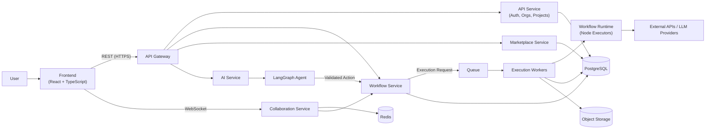
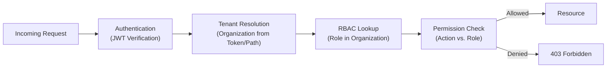
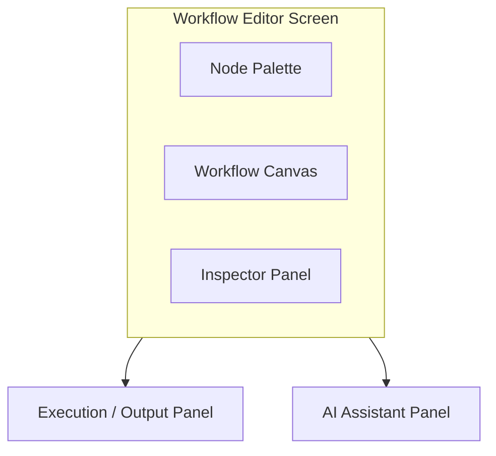
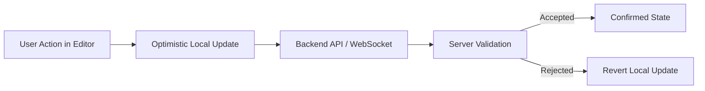
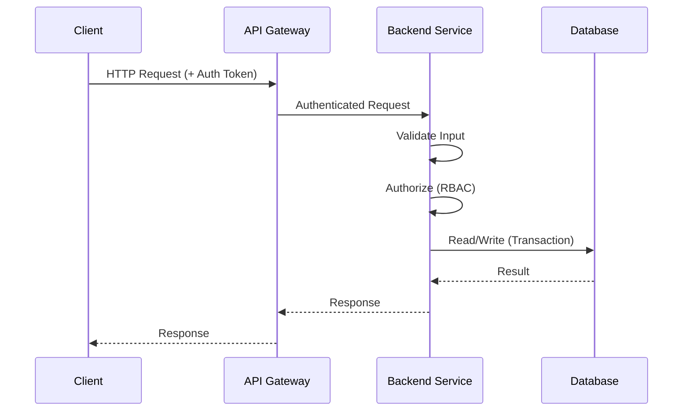
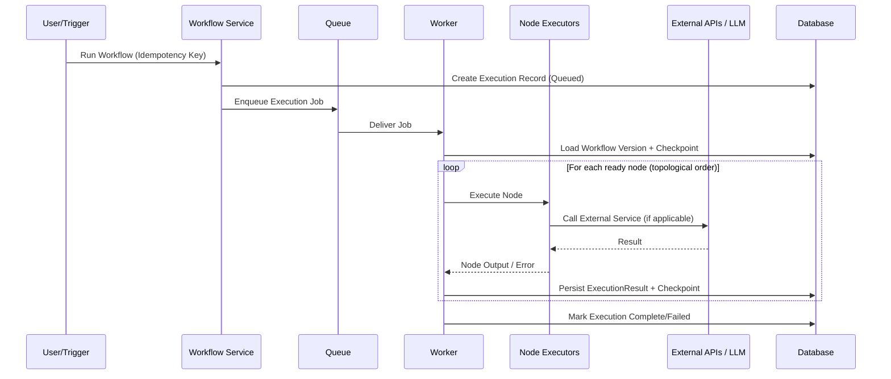
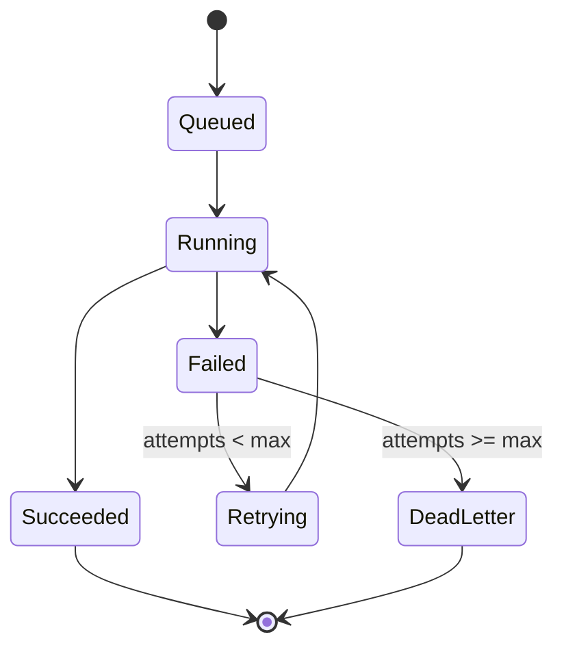

---

# 03 — System Architecture

## Architectural Style

Nexora is a **modular backend** deployed as a small number of independently deployable services, not a large microservice fleet. Synchronous request/response traffic goes through an API layer; long-running or resource-intensive work (workflow execution, AI reasoning) is offloaded to asynchronous workers via a queue. This keeps the system easy for an 8-person team to reason about while still demonstrating real distributed-systems concerns (see [[14 - Reliability and Distributed Systems]]).

## Overall System Diagram



## Service Responsibilities

| Service | Responsibility | Independently Deployable? |
|---|---|---|
| API Service | Authentication, organizations, projects, membership, RBAC | Yes |
| Workflow Service | Workflow CRUD, versioning, DAG validation, execution requests | Yes |
| Execution Workers | Pull execution jobs from the queue and run node graphs | Yes (scales independently of API) |
| AI Service | Hosts the LangGraph agent; produces structured, validated actions | Yes |
| Collaboration Service | WebSocket connections, presence, operation broadcast | Yes |
| Marketplace Service | Listings, entitlements, publishing lifecycle | Can start as a module inside the API Service; split out only if load or team ownership requires it |

> [!note]
> The Marketplace Service is the one component explicitly allowed to begin as a module rather than a separate deployment, since its request volume is expected to be low relative to workflow execution. See [[26 - Architectural Decision Records]] for the reasoning.

## Cross-Cutting Concerns

- **Authentication & Authorization:** every request through the API Gateway is authenticated and authorized before reaching a service — see [[09 - Multi-Tenancy and Security]] and [[19 - API Architecture]].
- **Asynchronous Execution:** the queue/worker split isolates slow or failure-prone work (workflow runs, AI calls) from the request/response path — see [[06 - Workflow Engine]] and [[14 - Reliability and Distributed Systems]].
- **Observability:** all services emit metrics, structured logs, and health endpoints — see [[15 - Observability]].
- **Deployment:** all services are containerized and deployed to a shared Kubernetes cluster — see [[11 - DevOps Architecture]] and [[12 - Infrastructure and Kubernetes]].

## Authentication / Authorization Flow



Related: [[05 - Backend Architecture]], [[09 - Multi-Tenancy and Security]], [[19 - API Architecture]]


---

# 04 — Frontend Architecture

## Design Principle

The frontend is kept as simple as it can be while remaining powerful enough for a graph-based editor and real-time collaboration. It introduces no framework or library without an explicit architectural reason, and it is **not the source of truth**: all business-critical validation and authorization are enforced by the backend (see [[05 - Backend Architecture]], [[09 - Multi-Tenancy and Security]]). The frontend may perform optimistic UI updates, but every mutation is re-validated server-side.

## Technology Choices

| Technology | Why It Is Used |
|---|---|
| React + TypeScript | Component model suited to a panel-based editor UI; static typing reduces integration errors against backend contracts |
| A routing solution (React Router) | Standard client-side navigation between dashboard, projects, editor, and marketplace views |
| A graph/workflow editor library (e.g., React Flow) | Provides canvas, node, and edge rendering/interaction primitives so the team does not build a graph renderer from scratch |
| A UI component library | Consistent, accessible baseline components (forms, dialogs, panels), avoiding bespoke design-system work outside the project's scope |
| HTTP client | Typed wrapper over REST calls to the API Gateway |
| WebSocket client | Persistent connection to the Collaboration Service for presence and live operations |
| Lightweight state management (e.g., a minimal store plus server-state caching) | Separates local UI state from server state; avoids a heavyweight global-state framework the team does not need |

> [!note] Decision Pending
> The exact UI component library and state-management library are implementation choices left to the Frontend track; neither affects the architecture described in this document.

## Application Areas

| Area | Purpose |
|---|---|
| Dashboard | Entry point showing the user's organizations and recent projects |
| Project List | Projects within the current organization |
| Workflow Editor | Canvas, node palette, inspector, execution panel — the core authoring surface |
| Workflow Canvas | Renders nodes/edges; source of user-issued graph operations |
| Node Palette | Catalog of available node types to drag onto the canvas |
| Inspector / Configuration Panel | Edits the selected node's parameters |
| Execution / Output Panel | Shows run status, per-node output, and execution history |
| AI Assistant | Natural-language interface that submits prompts to the AI Service and renders proposed actions |
| Collaboration Indicators | Presence avatars and live cursors/selection for other connected users |
| Marketplace | Browse, view, and acquire published workflows |
| Organization / Team Management | Membership, roles, and invitations |

## Editor Layout



## Data Flow



Because validation and authorization live entirely on the backend, the frontend can be re-implemented (e.g., a different editor library) without altering system correctness — a deliberate separation of concerns.

Related: [[05 - Backend Architecture]], [[08 - Real-Time Collaboration]], [[07 - AI Architecture]]


---

# 05 — Backend Architecture

## Service Decomposition

Nexora deliberately uses a **small number of meaningful services** rather than a large microservice fleet, so that operational complexity remains proportional to an 8-person team (see [[03 - System Architecture]] for the full diagram).

| Service | Owns | Deployment |
|---|---|---|
| API Service | Auth, organizations, projects, membership | Independent |
| Workflow Service | Workflow/version CRUD, DAG validation, execution requests | Independent |
| Execution Workers | Running workflow graphs pulled from the queue | Independent, scales separately from API |
| AI Service | LangGraph agent, tool registry, action validation | Independent |
| Collaboration Service | WebSocket connections, presence, operation broadcast | Independent |
| Marketplace Service | Listings, entitlements, publishing lifecycle | Starts as a module inside the API Service (see [[26 - Architectural Decision Records]]) |

## REST vs. GraphQL

Nexora's resource model (organizations, projects, workflows, nodes, executions) is CRUD-heavy with well-defined resource boundaries, which REST expresses directly and simply. GraphQL's main benefit — flexible client-driven queries across nested resources — matters less here than operational simplicity and cacheability. **REST is used for the MVP**; see [[26 - Architectural Decision Records]] for the full trade-off discussion.

## Core Backend Concerns

| Concern | Approach |
|---|---|
| Authentication | JWT access/refresh tokens issued by the API Service |
| Authorization | RBAC middleware resolving organization membership and role before every request reaches business logic |
| Validation | Schema validation (request bodies, workflow graphs, AI-proposed actions) at the service boundary, before persistence |
| Database Access | A single access layer per service; no service queries another service's tables directly |
| Transactions | Multi-row mutations (e.g., creating a workflow version and its nodes/edges) are wrapped in a single database transaction |
| WebSockets | Owned exclusively by the Collaboration Service; other services publish events to it rather than holding connections themselves |
| Rate Limiting | Per-user/per-organization token-bucket limits at the API Gateway |
| Idempotency | Execution-triggering requests accept an idempotency key so retried client requests do not duplicate work (see [[14 - Reliability and Distributed Systems]]) |
| Error Handling | Uniform error envelope (code, message, field errors) returned by every service; internal errors never leak stack traces to clients |
| Async Processing | Workflow execution and AI reasoning are queued rather than handled inline in the request/response cycle |

## Request Lifecycle (Synchronous Path)



## Asynchronous Path

Workflow execution and AI reasoning follow the queue/worker pattern described in [[06 - Workflow Engine]] and [[07 - AI Architecture]], rather than blocking a request thread.

Related: [[03 - System Architecture]], [[18 - Database and Data Architecture]], [[19 - API Architecture]]


---

# 06 — Workflow Engine

## Workflow Representation

A **Workflow** is a directed acyclic graph (DAG):

```
Workflow → Nodes → Edges → Configuration → Version
```

Each saved copy of a workflow's graph is an immutable **WorkflowVersion**; editing a workflow produces a new draft version rather than mutating history in place. This directly supports the versioning, rollback, and marketplace-publishing requirements (see [[02 - Requirements]], [[10 - Marketplace]]).

## Node Types (MVP)

| Type | Examples | Notes |
|---|---|---|
| Trigger | Manual run, incoming webhook | Entry point of the graph; a workflow has exactly one trigger for the MVP |
| Action | HTTP request, LLM call, web search | Performs an external effect or call |
| Transform | Map, filter, template/string interpolation | Pure data transformation between nodes |
| Output | Store result, return to caller | Terminal node(s) of the graph |

> [!note] Decision Pending
> The exact catalog of built-in Action node integrations (which external APIs are supported out of the box) is an implementation detail to be finalized during development, not an architectural decision.

## DAG Validation

Before a version is saved or executed, the Workflow Service validates that:

- The graph contains no cycles.
- Every node's required inputs are connected or configured.
- Every edge connects compatible node output/input types.
- The graph contains exactly one trigger and at least one reachable output.

## Execution Model



## Execution State



## Checkpointing and Retries

Each node's result is persisted as it completes. If an execution fails partway through, a retry resumes from the **last successfully completed node** rather than restarting the entire graph, using the stored checkpoint. Retries use exponential backoff up to a configured maximum; executions that exceed the maximum are moved to a dead-letter queue for manual inspection (see [[14 - Reliability and Distributed Systems]]).

## Versioning and History

- Every execution references the specific `WorkflowVersion` it ran, so historical runs remain reproducible even after the workflow is edited further.
- Execution history (status, duration, per-node results) is retained and browsable from the Execution/Output Panel (see [[04 - Frontend Architecture]]).

Related: [[07 - AI Architecture]] (which proposes graph mutations through the same validation path), [[14 - Reliability and Distributed Systems]], [[18 - Database and Data Architecture]]
