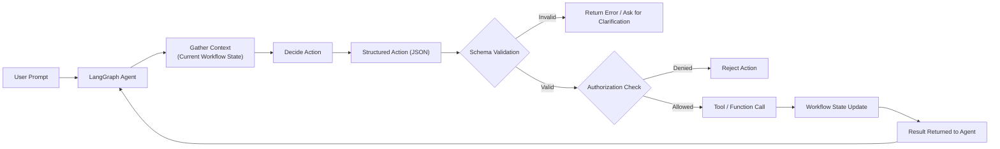
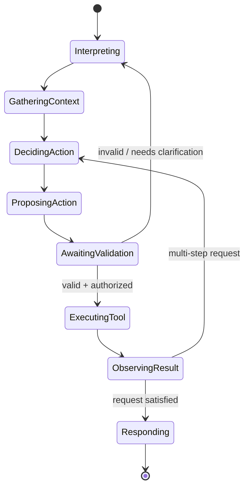
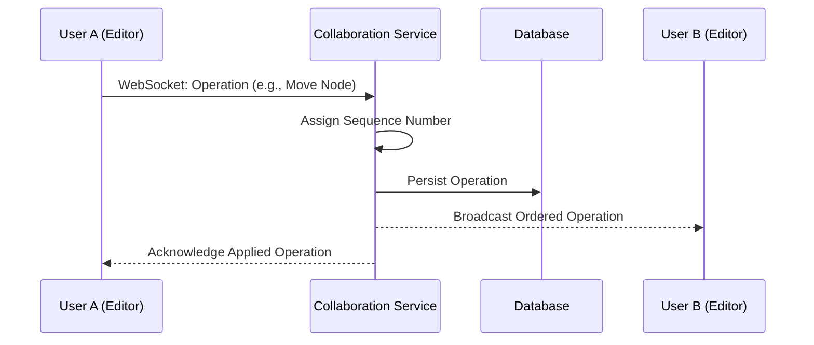
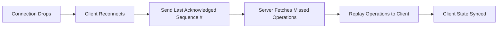
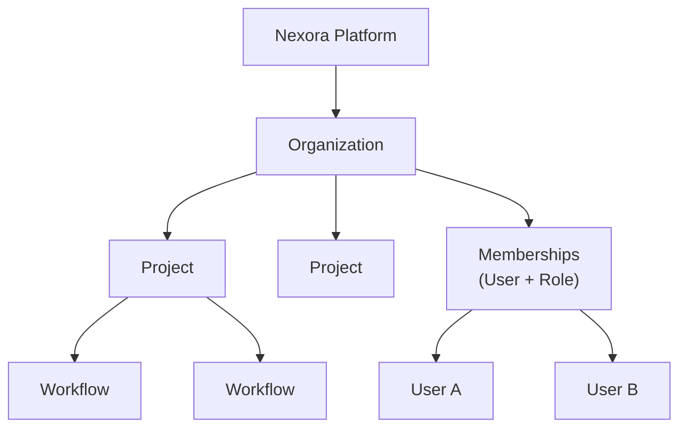
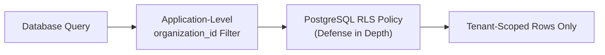
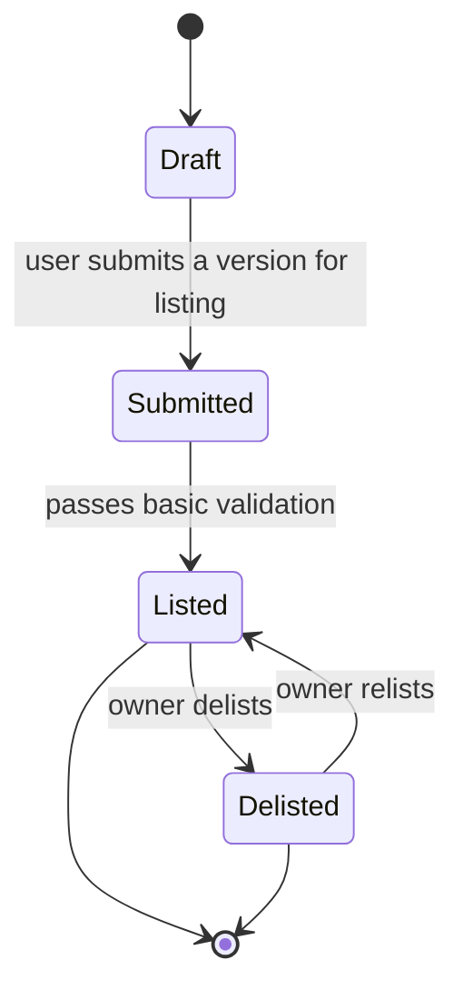
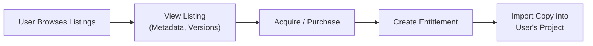

---

# 07 — AI Architecture

## Design Principle

The AI agent is a **bounded, deterministic actor**, not an unrestricted autonomous system. It never modifies application state directly and never executes arbitrary code. Every effect it produces passes through the same structured-action validation and authorization path used by manual UI operations (see [[06 - Workflow Engine]], [[09 - Multi-Tenancy and Security]]).

```
Natural Language → Agent → Structured Action → Schema Validation → Authorization → Function/Tool Call → Application State Update → Result
```

## Responsibilities of Each Component

| Component | Responsibility |
|---|---|
| LangChain | Provides the LLM abstraction layer, prompt templating, and tool-wrapping utilities used to expose backend functions to the agent |
| LangGraph | Orchestrates the agent as an explicit **state graph**: interpret prompt → gather context → decide action → propose structured action → await validation/authorization result → update conversation state → respond |
| LLM | Interprets natural language and context, and selects/populates a structured action from the registered tool set; it does not execute the action itself |
| Tools | Explicitly registered functions (e.g., `create_node`) that the agent may request; the agent has no access to any function not registered as a tool |
| Structured Actions | JSON objects conforming to a fixed schema per action type, produced by the LLM in place of free-form text |
| Validator | Checks a proposed action against its JSON Schema and the current workflow's DAG constraints before it is allowed to execute |
| Authorization Layer | Confirms the requesting user has permission to perform the equivalent manual action, exactly as if they had used the UI |

## Why the LLM Never Modifies the Database or Executes Code Directly

- **Determinism and auditability:** every mutation must be traceable to a validated, schema-conformant action, not to unconstrained model output.
- **Safety:** an LLM producing arbitrary code or raw queries could not be reliably sandboxed within this project's scope.
- **Consistency:** routing AI actions through the same backend functions used by the UI guarantees the same invariants (DAG validity, authorization, versioning) apply regardless of the action's origin.

## Agent Execution Flow



## Agent State Machine (LangGraph)



## Registered Tools (MVP)

| Tool | Effect |
|---|---|
| `create_node` | Adds a node of a given type/config to the current draft version |
| `delete_node` | Removes a node and its connected edges |
| `update_node` | Changes a node's configuration |
| `connect_nodes` | Adds an edge between two nodes |
| `disconnect_nodes` | Removes an edge |
| `set_node_config` | Sets specific configuration fields on a node |
| `run_workflow` | Triggers an execution of the current draft version |

## Example: Structured Action Schema

```json
{
  "action": "create_node",
  "parameters": {
    "workflow_id": "wf_123",
    "node_type": "action.web_search",
    "config": {
      "query_template": "{{input.topic}}"
    }
  },
  "requested_by": "agent",
  "conversation_id": "conv_456"
}
```

## Example: Multi-Step Prompt

**User:** "Create a workflow that searches the web and summarizes the results."

**Agent-proposed action sequence:**

```json
[
  { "action": "create_node", "parameters": { "node_type": "trigger.manual" } },
  { "action": "create_node", "parameters": { "node_type": "action.web_search" } },
  { "action": "create_node", "parameters": { "node_type": "action.llm_summarize" } },
  { "action": "connect_nodes", "parameters": { "from": "trigger", "to": "web_search" } },
  { "action": "connect_nodes", "parameters": { "from": "web_search", "to": "llm_summarize" } }
]
```

Each action in the sequence is validated and authorized independently before being applied; a failure partway through halts the sequence and reports which actions succeeded.

## Error Handling and Tool Results

If validation or authorization fails, the agent receives a structured error (not a raw exception) and can either ask the user for clarification or abandon the request. Successful tool calls return their result to the agent's state so subsequent steps in a multi-step request can reference prior outputs (e.g., a newly created node's ID).

## Conversation and Workflow State

The agent maintains conversation state (LangGraph's graph state) scoped to a single editing session, separate from the workflow's own persisted state in the database. This separation means a conversation can be abandoned without side effects, since only validated, authorized actions ever reach persisted workflow state.

Related: [[06 - Workflow Engine]], [[08 - Real-Time Collaboration]] (AI-issued actions are broadcast to collaborators the same way user actions are), [[09 - Multi-Tenancy and Security]]


---

# 08 — Real-Time Collaboration

## Scope for the MVP

Multiple users from the same organization can edit the same workflow concurrently, see who else is online, and see each other's changes as they happen. Conflict resolution uses a **server-authoritative** model: the Collaboration Service is the single source of ordering truth for a given workflow. This is intentionally simpler than CRDT/OT-based merging, which is documented as a future enhancement (see [[22 - MVP vs Future Work]]) rather than an MVP dependency.

## Connection Lifecycle

1. Client authenticates and opens a WebSocket connection to the Collaboration Service, specifying the workflow it wants to join.
2. The service verifies the user's authorization to access that workflow (via the same RBAC check used by REST requests).
3. The service registers the client's presence and broadcasts a "user joined" event to other connected collaborators.
4. On disconnect (including network drop), the service broadcasts a "user left" event and, on reconnection, replays any operations the client missed since its last acknowledged sequence number.

## Message Flow



## Event Types

| Event | Direction | Purpose |
|---|---|---|
| `presence.join` / `presence.leave` | Server → Clients | Track who is currently viewing/editing a workflow |
| `operation.submit` | Client → Server | Propose a graph mutation (move/add/delete node, connect/disconnect edge, config change) |
| `operation.broadcast` | Server → Clients | Ordered, persisted operation delivered to all other connected collaborators |
| `operation.ack` | Server → Originating Client | Confirms an operation was accepted and its assigned sequence number |
| `comment.added` | Server → Clients | New comment on the workflow (stretch goal, see [[02 - Requirements]]) |

## Ordering and Persistence

Every accepted operation is assigned a monotonically increasing sequence number scoped to its workflow and persisted before being broadcast, so a client that reconnects can request "operations since sequence N" and replay them to reach a consistent state without a full reload.

## Reconnection Handling



## Conflict Handling (MVP)

Because the server assigns a single order to all operations on a given workflow, two simultaneous edits are resolved by whichever operation the server sequences first; the second is applied on top of the already-updated state (last-write-wins at the level of individual node/edge fields, not whole-document overwrite). This is sufficient for the collaboration patterns expected in a graduation-project demo (a handful of concurrent editors) without the implementation cost of CRDT/OT.

> [!note] Future Work
> CRDT- or OT-based merging would allow true concurrent, conflict-free edits (including offline edits) and is documented as a stretch goal in [[22 - MVP vs Future Work]].

## AI-Issued Operations

Actions produced by the AI agent (see [[07 - AI Architecture]]) are applied through the same operation path as manually issued ones, so all collaborators see AI-driven changes live, with the same ordering and persistence guarantees.

Related: [[06 - Workflow Engine]], [[09 - Multi-Tenancy and Security]], [[04 - Frontend Architecture]]


---

# 09 — Multi-Tenancy and Security

## Tenant Model



The **Organization** is the tenant boundary. A **Project** groups related workflows within an organization. A **Membership** links a user to an organization with a **role** that determines permissions. A `Team` sub-grouping within larger organizations is a plausible future refinement but is not required for the MVP tenant model (see [[22 - MVP vs Future Work]]).

## Roles and Permissions (MVP)

| Role | Typical Permissions |
|---|---|
| Owner | Full control, including billing/organization deletion |
| Admin | Manage members, projects, and workflows |
| Editor | Create/edit workflows within assigned projects |
| Viewer | Read-only access to workflows and execution results |

Permission checks are enforced **on every API request** by the RBAC middleware described in [[03 - System Architecture]] and [[19 - API Architecture]] — never assumed from frontend state.

## Tenant Isolation Strategies (Comparison)

| Strategy | Isolation Strength | Operational Overhead | Migration Complexity |
|---|---|---|---|
| Shared database, shared schema (tenant_id column) | Moderate — relies on correct query scoping | Low | Low |
| Shared database, separate schema per tenant | Strong | Moderate | Moderate (schema per tenant to migrate) |
| Separate database per tenant | Strongest | High | High |

**Recommendation for the MVP: shared database, shared schema**, with every tenant-scoped table carrying an `organization_id` column, every query scoped by it at the application layer, and PostgreSQL **Row-Level Security (RLS)** policies as defense-in-depth against an application-layer scoping bug. This keeps operational overhead low enough for an 8-person team while still demonstrating a genuine tenant-isolation mechanism. Schema-per-tenant or database-per-tenant are documented as scaling paths if stronger isolation is later required (see [[26 - Architectural Decision Records]]).

## Enforcement Points



## Security Practices

| Area | Practice |
|---|---|
| Authentication | JWT access/refresh tokens; passwords hashed with a modern algorithm (e.g., bcrypt/argon2) |
| Authorization | RBAC middleware on every request; resource ownership re-checked at the data-access layer, not only at the route level |
| Transport | TLS everywhere; no plaintext internal traffic between services in production |
| Secrets | Managed via Kubernetes Secrets / a secrets manager, never committed to source control (see [[11 - DevOps Architecture]]) |
| Input Validation | All request bodies and AI-proposed actions validated against a schema before use (see [[07 - AI Architecture]], [[19 - API Architecture]]) |
| Auditability | Sensitive mutations (membership changes, role changes, marketplace publishing) are logged with actor, action, and timestamp |

Related: [[03 - System Architecture]], [[18 - Database and Data Architecture]], [[07 - AI Architecture]]


---

# 10 — Marketplace

## Purpose

The marketplace lets organizations publish finished workflows for other users to discover, reuse, or acquire, turning individually built automations into shared, reusable assets.

## Core Concepts

| Concept | Description |
|---|---|
| MarketplaceListing | A published, browsable reference to a specific `WorkflowVersion` (immutable snapshot) |
| Ownership | The organization/user that created the original workflow retains authorship attribution |
| Entitlement | A record granting a specific user/organization the right to import a copy of a listed workflow into their own projects |
| Publishing Lifecycle | Draft → Submitted → Listed → (optionally) Delisted |

## Publishing Lifecycle



## Acquisition Flow



Acquiring a listed workflow creates an independent copy in the acquiring organization's project space; the original listing is unaffected, and future edits by either party do not propagate to the other, keeping ownership and versioning unambiguous.

## Payments

> [!note] Decision Pending
> Real payment processing is treated as **out of MVP scope** (see [[22 - MVP vs Future Work]]). The Marketplace Service depends on an abstract `PaymentProvider` interface with a single method (e.g., `charge(entitlement_request)`); the MVP implementation can simulate a successful charge or support free listings only, without changing any other component if a real provider (e.g., a hosted checkout) is integrated later.

## What Is Tracked

| Entity | Purpose |
|---|---|
| MarketplaceListing | Published metadata: title, description, referenced `WorkflowVersion`, publishing status |
| Purchase / Entitlement | Record of who acquired what, and when |
| Comment | Optional user feedback on a listing (stretch goal) |

## Access Control

Publishing and delisting are restricted to organization roles with sufficient permission on the source workflow (see [[09 - Multi-Tenancy and Security]]); acquiring a listing only requires standard authenticated access, independent of the acquiring user's role in the *source* organization.

Related: [[06 - Workflow Engine]] (versions are the unit of publishing), [[18 - Database and Data Architecture]], [[22 - MVP vs Future Work]]
