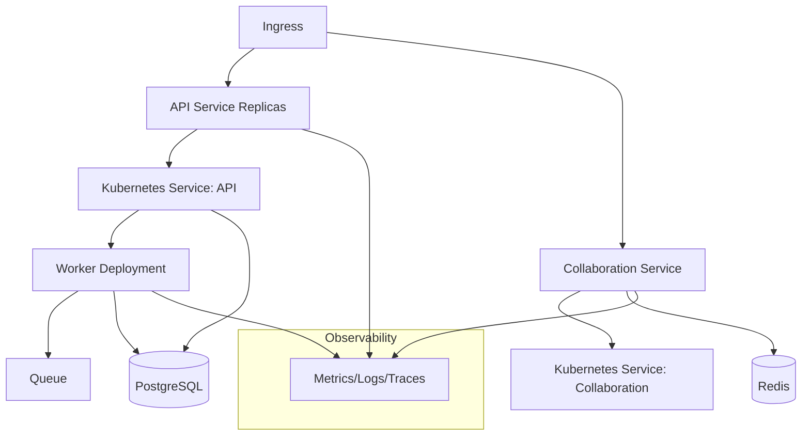
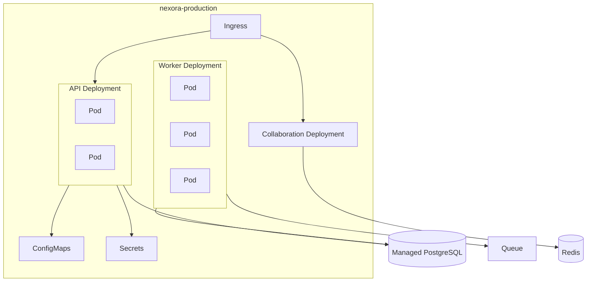
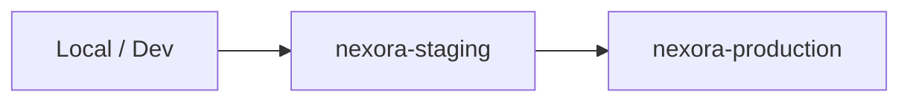
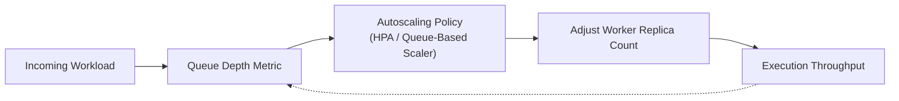
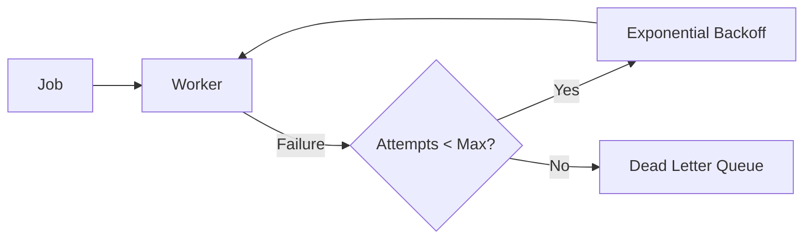
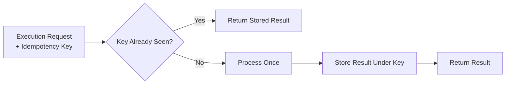
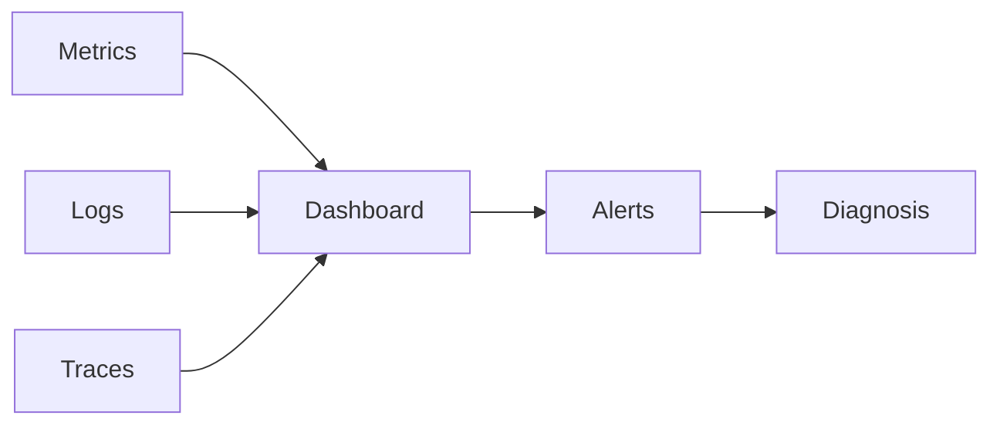
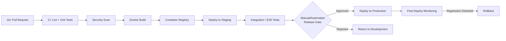

---

# 11 — DevOps Architecture

## Role in the System

DevOps provides the deployment, automation, and operational foundation that lets the frontend, backend, workflow engine, AI service, and collaboration service run together as one deployed system. It is one of ten subsystems described in this documentation set (see the [[README|homepage]]) and is owned by a single team member with real engineering scope — not reduced to "run `docker push`."

## Containerization

Each service (API, Workflow, AI, Collaboration, Marketplace, Workers, Frontend) is built as its own container image using **multi-stage Docker builds**: a build stage compiles/installs dependencies, and a minimal runtime stage carries only what is needed to run, keeping images small. Images run as **non-root** users, define **health-check** endpoints, and receive configuration exclusively through environment variables/mounted config, never baked into the image.

## Kubernetes

Each service is deployed as a Kubernetes **Deployment** fronted by a **Service**; environment-specific values live in **ConfigMaps**, and credentials in **Secrets**. **Namespaces** separate `staging` from `production`. Every Deployment declares resource **requests/limits** and **liveness/readiness probes** so Kubernetes can make correct scheduling and restart decisions.

## Infrastructure as Code

Infrastructure (cluster, networking, managed PostgreSQL, object storage, Redis) is provisioned with **Terraform**, giving the team reproducible environments, code-reviewable infrastructure changes, and the ability to tear down and recreate `staging` on demand rather than hand-configuring cloud resources.

> [!note] Decision Pending
> A specific cloud provider is not fixed in this documentation; the Terraform modules are structured so that provider-specific resources are isolated behind a small set of modules (cluster, database, storage, cache), limiting the blast radius of a later provider decision.

## Deployment Pipeline (Summary)

The full pipeline from pull request to production is described in [[16 - CI-CD and Deployment]]. In summary: pull request → automated tests/lint/security scan → image build → registry push → staging deployment → production deployment (with rollback capability).

## Scaling, Observability, and Reliability

Detailed separately so DevOps does not absorb every operational concern into a single oversized document:

- Horizontal scaling and load balancing: [[13 - Scalability and Load Balancing]]
- Distributed-systems reliability mechanisms: [[14 - Reliability and Distributed Systems]]
- Metrics, logs, traces, dashboards, alerts: [[15 - Observability]]
- Full CI/CD pipeline: [[16 - CI-CD and Deployment]]
- Load, failure, and rollback testing: [[17 - Testing Strategy]]

## Cluster Topology Reference

Kubernetes resource layout is detailed in [[12 - Infrastructure and Kubernetes]].

Related: [[03 - System Architecture]], [[24 - Team Responsibilities]]

---

# 12 — Infrastructure and Kubernetes

This document details the Kubernetes resource layout introduced at a high level in [[11 - DevOps Architecture]].

## Namespace Layout

| Namespace | Purpose |
|---|---|
| `nexora-staging` | Pre-production validation environment |
| `nexora-production` | Production environment |
| `nexora-observability` | Shared monitoring stack (metrics, dashboards, log aggregation) |

## Resource Layout

## Per-Service Configuration

| Setting | Purpose |
|---|---|
| Resource requests/limits | Guarantee minimum scheduling capacity and cap runaway resource usage per pod |
| Liveness probe | Restarts a pod that has become unresponsive |
| Readiness probe | Removes a pod from load-balancing until it can actually serve traffic |
| ConfigMap | Non-secret configuration (feature flags, external endpoints) |
| Secret | Database credentials, JWT signing keys, third-party API keys |

## Ingress

A single Ingress controller routes `/api/*` to the API Service, `/ws` to the Collaboration Service, and static frontend assets to a CDN or the frontend's own deployment, terminating TLS at the edge.

## Environment Promotion

Terraform provisions the underlying cluster and managed services (database, cache, storage) for each environment from the same modules, with environment-specific variable files, so `staging` and `production` are structurally identical and drift is minimized.

Related: [[11 - DevOps Architecture]], [[13 - Scalability and Load Balancing]], [[16 - CI-CD and Deployment]]

---

# 13 — Scalability and Load Balancing

## Independent Scaling Axes

The API Service and Execution Workers scale independently because their load profiles differ: API load tracks concurrent users, while worker load tracks queued execution jobs. Decoupling them (see [[03 - System Architecture]]) means a burst of workflow executions does not require scaling — or does not starve — the interactive API path.

## Horizontal Scaling

| Component | Scaling Trigger |
|---|---|
| API Service | CPU/memory utilization, request rate |
| Collaboration Service | Active WebSocket connection count |
| Execution Workers | Queue depth (primary signal) |

## Autoscaling Flow

For the MVP, Kubernetes' **Horizontal Pod Autoscaler (HPA)** scales the API Service on CPU utilization, and the Worker Deployment on queue depth (via a custom metric or a queue-aware autoscaler). More sophisticated autoscaling (e.g., predictive scaling, cost-aware policies) is documented as future work in [[22 - MVP vs Future Work]].

## Load Balancing

The Ingress controller load-balances incoming HTTP traffic across API Service replicas; the Collaboration Service is load-balanced at connection time, with each WebSocket pinned to the replica that accepted it for the life of that connection (sticky by connection, not by request).

## Caching

Redis caches frequently read, rarely changed data (e.g., organization membership lookups used on every authorization check) to reduce database load under scale, with a short TTL and explicit invalidation on membership changes.

## Database Scaling Considerations

For the MVP, a single managed PostgreSQL instance (with read replicas as a documented, not yet implemented, option) is sufficient given the expected graduation-project load. Sharding or multi-region database topologies are explicitly out of scope (see [[22 - MVP vs Future Work]]).

Related: [[11 - DevOps Architecture]], [[14 - Reliability and Distributed Systems]], [[06 - Workflow Engine]]

---

# 14 — Reliability and Distributed Systems

## Why This Matters

Workflow execution spans multiple asynchronous steps (queue → worker → node executors → external APIs), each of which can fail independently. Nexora treats partial failure as an expected condition, not an edge case, and applies standard distributed-systems mechanisms to recover from it.

## Retry with Backoff

Each execution attempt that fails is retried with exponential backoff (e.g., 1s, 2s, 4s, ...) up to a configured maximum attempt count. Exceeding the maximum moves the job to a **Dead Letter Queue (DLQ)** for manual inspection rather than retrying indefinitely.

## Idempotency

Every execution-triggering request accepts a client-supplied idempotency key. If a client retries the same request (e.g., after a timeout with an unclear outcome), the Workflow Service returns the original result instead of starting a duplicate execution — necessary because retried *requests* and retried *executions* are different concerns and both must be handled without duplicating side effects.

## Checkpointing

As described in [[06 - Workflow Engine]], each node's output is persisted as it completes, so a retried execution resumes from the last successful node rather than re-running already-completed, potentially side-effecting steps (e.g., an external API call that should not be repeated).

## Health Checks and Graceful Shutdown

- **Liveness/readiness probes** (see [[12 - Infrastructure and Kubernetes]]) let Kubernetes detect and replace unhealthy pods automatically.
- On shutdown (e.g., during a rolling deployment), workers finish or safely checkpoint in-flight jobs before exiting, rather than dropping them mid-execution.

## Backup and Recovery

PostgreSQL is backed up on a scheduled basis (managed-service automated backups for the MVP), with a documented, tested restore procedure rather than an assumed-but-unverified backup.

## Distributed Systems Concepts Demonstrated

| Concept | Where It Appears |
|---|---|
| At-least-once delivery | Queue-based execution jobs |
| Idempotent request handling | Execution-triggering API requests |
| Checkpointing | Per-node execution results |
| Backoff and retry limits | Failed node execution |
| Dead-letter handling | Executions exceeding retry limits |
| Eventual consistency | Collaboration Service broadcasting to clients with slight, bounded delay |

Related: [[06 - Workflow Engine]], [[13 - Scalability and Load Balancing]], [[17 - Testing Strategy]] (failure/recovery testing verifies these mechanisms)

---

# 15 — Observability

## Purpose

Observability lets the team detect, diagnose, and explain system behavior in staging and production — required both for operational credibility and to demonstrate the failure/recovery scenarios in the [[25 - Final Demo]].

## Signal Types

| Signal | Examples | Purpose |
|---|---|---|
| Metrics | Request rate/latency, queue depth, worker throughput, error rate | Quantitative health, autoscaling input |
| Logs | Structured (JSON) request and job logs with correlation IDs | Detailed post-hoc investigation |
| Traces | End-to-end span across API → Queue → Worker → External Call | Understanding latency across service boundaries |

## Stack

| Layer | Tool |
|---|---|
| Metrics | Prometheus |
| Dashboards | Grafana |
| Logs | Structured JSON logs shipped to a log aggregator |
| Traces | OpenTelemetry instrumentation (basic spans for the MVP; full distributed tracing across every hop is a stretch refinement) |

## Correlation

Every request and every execution job carries a correlation ID propagated through logs, metrics labels, and trace spans, so a single failed execution can be followed from the API request that triggered it through the worker that processed it to the specific node that failed.

## Alerting

Alerts are defined on symptoms visible to users (elevated API error rate, growing queue depth, execution failure rate) rather than only on low-level infrastructure metrics, so an on-call responder is pointed toward user impact first.

## Dashboards (MVP)

| Dashboard | Content |
|---|---|
| API Health | Request rate, latency percentiles, error rate |
| Execution Pipeline | Queue depth, worker throughput, execution success/failure rate, DLQ size |
| Collaboration | Active WebSocket connections, message broadcast latency |

Related: [[11 - DevOps Architecture]], [[14 - Reliability and Distributed Systems]], [[17 - Testing Strategy]]

---

# 16 — CI/CD and Deployment

## Pipeline Overview

## Stage Details

| Stage | Activity |
|---|---|
| Pull Request | Triggers the pipeline; requires passing checks before merge |
| Lint + Unit Tests | Static analysis and fast unit tests per service |
| Security Scan | Dependency and container image vulnerability scanning |
| Docker Build | Multi-stage build per changed service (see [[11 - DevOps Architecture]]) |
| Registry Push | Tagged, immutable image pushed to the container registry |
| Staging Deployment | Automatic deployment to `nexora-staging` via the same Kubernetes manifests used in production |
| Integration / E2E Tests | Automated tests against the live staging environment (see [[17 - Testing Strategy]]) |
| Release Gate | Promotion to production requires passing staging tests and (for the MVP) a manual approval step |
| Production Deployment | Rolling deployment with health checks gating traffic shift |
| Rollback | A failed post-deploy health/metric check triggers reverting to the previous known-good image tag |

## Rollback Mechanism

Kubernetes rolling updates retain the previous ReplicaSet during a deployment; a rollback re-promotes it, which is faster and safer than rebuilding an old image from source. Rollback is exercised deliberately as part of testing (see [[17 - Testing Strategy]]), not left untested until an actual incident.

## Environments

| Environment | Purpose | Deployment Trigger |
|---|---|---|
| Staging | Pre-production validation | Automatic, on merge to main |
| Production | Live environment | Manual/gated promotion from a validated staging build |

Related: [[11 - DevOps Architecture]], [[12 - Infrastructure and Kubernetes]], [[17 - Testing Strategy]]
