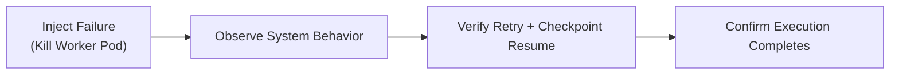
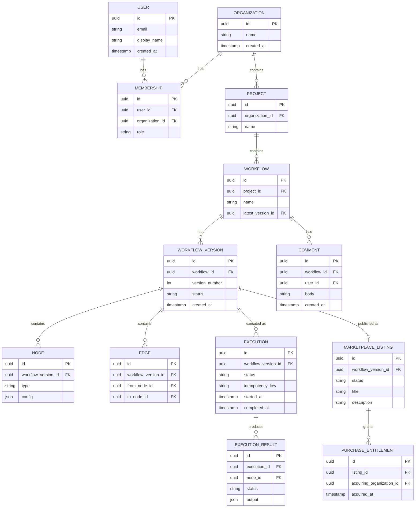

---

# 17 — Testing Strategy

## Testing Pyramid

| Level | Scope | Examples |
|---|---|---|
| Unit | Individual functions/modules | DAG validation, action-schema validation, RBAC permission logic |
| Integration | A service plus its real dependencies (test database, test queue) | Workflow Service creating a version and enqueuing an execution |
| Contract | Schemas shared across boundaries | AI action JSON Schemas, REST request/response shapes |
| End-to-End (E2E) | Full user flows through the deployed frontend and backend | Create workflow → run it → view output; AI modifies a workflow |
| Load | System behavior under sustained/burst traffic | API throughput, worker throughput under queued executions |
| Failure / Chaos | System behavior when a component fails | Kill a worker mid-execution; verify retry and checkpoint resume |
| Deployment | The deployment mechanism itself | Rollback correctness after a failed release |

## Tooling

| Concern | Tool |
|---|---|
| Backend unit/integration tests | Language-appropriate test framework (e.g., pytest/Jest, per implementation language) |
| Frontend/E2E | Cypress or Playwright |
| Load testing | k6 or Locust |
| Security scanning | Container/dependency scanner integrated into CI (see [[16 - CI-CD and Deployment]]) |

## What Is Tested Where

- **AI action validation** ([[07 - AI Architecture]]): unit tests assert malformed or unauthorized actions are rejected before reaching a tool call.
- **Multi-tenancy** ([[09 - Multi-Tenancy and Security]]): integration tests assert one organization can never read or mutate another's data, including via the RBAC middleware and RLS policies.
- **Execution reliability** ([[14 - Reliability and Distributed Systems]]): failure tests kill a worker mid-execution and assert the retried execution resumes from the last checkpoint rather than restarting or duplicating side effects.
- **Real-time collaboration** ([[08 - Real-Time Collaboration]]): integration tests assert operations are delivered in order and that a reconnecting client replays missed operations correctly.

## Failure and Recovery Testing



## Deployment Rollback Testing

A staging-only pipeline run deliberately deploys a build with a known regression, confirms the post-deploy health check detects it, and confirms the rollback mechanism (see [[16 - CI-CD and Deployment]]) restores the previous known-good version without manual intervention beyond triggering the rollback.

## Ownership

While QA/Testing is a named track (see [[24 - Team Responsibilities]]), test authorship is distributed: each track writes unit/integration tests for its own subsystem, and the QA/Testing track owns E2E, load, failure, and deployment testing plus overall coverage review.

Related: [[24 - Team Responsibilities]], [[14 - Reliability and Distributed Systems]], [[16 - CI-CD and Deployment]]


---

# 18 — Database and Data Architecture

## Primary Datastore

PostgreSQL is the system of record for organizations, projects, workflows, versions, executions, and marketplace data (see [[26 - Architectural Decision Records]] for the "why PostgreSQL" discussion). Redis is used narrowly for caching and ephemeral collaboration/presence state (see [[13 - Scalability and Load Balancing]]). Object storage holds large binary artifacts (e.g., execution logs/exports), not queried relationally.

## Entity-Relationship Diagram



> [!note] Decision Pending
> A `Team` entity as an intermediate grouping between Organization and User/Project is not included in the MVP data model (see [[09 - Multi-Tenancy and Security]]); it is a plausible additive change if organizations require sub-group permissions.

## Tenant Scoping

Every table reachable from `Organization` (directly or transitively) carries or can be resolved to an `organization_id`, which is the basis for the row-level scoping and RLS policies described in [[09 - Multi-Tenancy and Security]].

## Transactions

Operations that touch multiple tables atomically — creating a `WorkflowVersion` with its `Node`/`Edge` rows, or recording an `Execution` alongside its first `ExecutionResult` — are wrapped in a single database transaction so partial writes are never visible.

## Data Lifecycle Notes

- `WorkflowVersion` rows are immutable once created; edits produce a new version (see [[06 - Workflow Engine]]).
- `Execution` and `ExecutionResult` rows are retained for history/auditability; large `output` payloads may be stored by reference in object storage rather than inline, if size warrants it (implementation detail, not fixed here).

Related: [[05 - Backend Architecture]], [[06 - Workflow Engine]], [[10 - Marketplace]], [[09 - Multi-Tenancy and Security]]


---

# 19 — API Architecture

## Style

REST over HTTPS for all synchronous client-facing operations; WebSockets (owned by the Collaboration Service, see [[08 - Real-Time Collaboration]]) for real-time operations. The rationale for REST over GraphQL is covered in [[05 - Backend Architecture]] and [[26 - Architectural Decision Records]].

## Resource Model (Representative)

| Resource | Example Endpoints |
|---|---|
| Auth | `POST /auth/login`, `POST /auth/refresh` |
| Organizations | `GET /organizations`, `POST /organizations`, `POST /organizations/{id}/members` |
| Projects | `GET /projects`, `POST /projects` |
| Workflows | `GET /workflows/{id}`, `POST /workflows`, `POST /workflows/{id}/versions` |
| Executions | `POST /workflows/{id}/executions` (Idempotency-Key header required) |
| AI | `POST /ai/conversations/{id}/messages` |
| Marketplace | `GET /marketplace/listings`, `POST /marketplace/listings/{id}/acquire` |

## Authentication and Authorization

Every request (except `/auth/*`) requires a valid JWT access token. The authorization pipeline is shown in [[03 - System Architecture]]: authentication → tenant resolution → RBAC lookup → permission check, executed as shared middleware ahead of any service's business logic.

## Idempotency

Endpoints that trigger side effects with real-world cost (primarily `POST .../executions`) require an `Idempotency-Key` header; the server stores the key-to-result mapping so a retried request returns the original result rather than creating a duplicate execution (see [[14 - Reliability and Distributed Systems]]).

## Rate Limiting

A token-bucket limiter at the API Gateway enforces per-user and per-organization request-rate ceilings, returning `429 Too Many Requests` with a `Retry-After` header when exceeded.

## Error Format

```json
{
  "error": {
    "code": "VALIDATION_ERROR",
    "message": "Node configuration is invalid.",
    "fields": {
      "config.query_template": "must not be empty"
    }
  }
}
```

Every service returns this envelope shape, so frontend error handling (see [[04 - Frontend Architecture]]) is uniform regardless of which backend service produced the error.

## Versioning

The API is versioned by URL prefix (e.g., `/v1/...`); breaking changes are introduced under a new prefix rather than mutating an existing one, so the frontend and any external integrators are never broken by an in-place change.

Related: [[05 - Backend Architecture]], [[09 - Multi-Tenancy and Security]], [[07 - AI Architecture]]


---

# 20 — Technology Stack

Every technology below is included for a specific architectural reason, not for popularity. Items marked **Optional/Stretch** are not required for the MVP to function.

## Frontend

| Technology | What It Does | Why Used | Problem Solved | MVP? |
|---|---|---|---|---|
| React + TypeScript | UI rendering with static typing | Component model fits a panel-based editor; typing catches integration errors against API contracts | Untyped UI-backend integration bugs | Yes |
| React Router | Client-side routing | Standard navigation between dashboard/editor/marketplace | Multi-view SPA navigation | Yes |
| React Flow (or equivalent) | Graph/canvas rendering | Provides node/edge rendering and interaction primitives | Building a graph editor from scratch | Yes |
| UI component library | Base components (forms, dialogs) | Consistent, accessible baseline without custom design-system work | Reinventing basic UI primitives | Yes |
| WebSocket client | Persistent real-time connection | Required for presence/collaboration | Real-time updates over HTTP polling | Yes |
| Lightweight state/query library | Server-state caching, local UI state | Avoids a heavyweight global-state framework | Ad-hoc state duplication/staleness | Yes |

## Backend

| Technology | What It Does | Why Used | Problem Solved | MVP? |
|---|---|---|---|---|
| Backend framework (language-appropriate) | HTTP routing, request handling | Mature ecosystem for REST APIs, middleware, validation | Building HTTP handling from scratch | Yes |
| PostgreSQL | Relational, transactional datastore | ACID transactions, mature tooling, strong relational modeling fit for the ER model in [[18 - Database and Data Architecture]] | Consistent, queryable system of record | Yes |
| Redis | In-memory cache/pub-sub | Low-latency caching and presence broadcast across Collaboration Service instances | Cross-instance state without a shared process | Yes |
| Message Queue | Asynchronous job delivery | Decouples request path from slow workflow execution | Long-running work blocking API responses | Yes |
| Object Storage (S3-compatible) | Binary artifact storage | Cost-effective storage for large, non-relational payloads | Bloating the relational database with binary data | Yes |

## AI

| Technology | What It Does | Why Used | Problem Solved | MVP? |
|---|---|---|---|---|
| LangChain | LLM abstraction, prompt templating, tool wrapping | Avoids hand-rolling LLM-provider integration and tool-calling plumbing | Provider lock-in, repetitive integration code | Yes |
| LangGraph | Stateful agent orchestration | Expresses the agent as an explicit, inspectable state graph (see [[07 - AI Architecture]]) | Unstructured, hard-to-debug agent loops | Yes |
| JSON Schema (or equivalent, e.g., Pydantic) | Structured-output validation | Enforces that AI-proposed actions conform to a fixed schema before execution | Unvalidated, unsafe model output | Yes |

## Platform / DevOps

| Technology | What It Does | Why Used | Problem Solved | MVP? |
|---|---|---|---|---|
| Docker | Containerization | Consistent runtime across dev/staging/production | "Works on my machine" | Yes |
| Kubernetes | Container orchestration | Declarative scaling, self-healing, rolling deployments | Manual process/server management | Yes |
| Terraform | Infrastructure as Code | Reproducible, reviewable infrastructure | Manual, undocumented cloud configuration | Yes |
| Prometheus + Grafana | Metrics and dashboards | Quantitative system health and autoscaling input | Blind operation in production | Yes |
| OpenTelemetry | Tracing | Cross-service latency visibility | Debugging latency across service boundaries | Optional/Stretch (basic spans are MVP; full trace coverage is stretch) |
| k6 / Locust | Load testing | Validates throughput/scaling claims before production | Untested scaling assumptions | Yes |

Related: [[03 - System Architecture]], [[11 - DevOps Architecture]], [[07 - AI Architecture]], [[26 - Architectural Decision Records]]


---

# 21 — Software Engineering Concepts

This table maps core Computer Science and Software Engineering concepts to where they appear in Nexora, why each is needed, and how it can be demonstrated in the final defense.

| Concept | Where It Appears | Why Needed | How Demonstrated |
|---|---|---|---|
| SOLID | Backend service boundaries; tool/action handlers in [[07 - AI Architecture]] | Keeps each service/module independently modifiable and testable | Show a tool handler extended with a new action type without modifying existing handlers |
| Clean Architecture | Backend layering (API → service logic → data access) | Isolates business rules from frameworks/infrastructure | Show business logic unit-tested without a live database |
| Design Patterns | Strategy pattern for node executors ([[06 - Workflow Engine]]); Adapter for the `PaymentProvider` interface ([[10 - Marketplace]]) | Encapsulate variation points behind stable interfaces | Add a new node type or payment provider without touching callers |
| API Design | [[19 - API Architecture]] | Predictable, versionable client-server contract | REST resource model, consistent error envelope |
| Modular Architecture | [[03 - System Architecture]] | Small number of cohesive services instead of an unstructured monolith or excessive microservices | Service responsibility table with clear ownership boundaries |
| Distributed Systems | Queue/worker execution, Collaboration Service ordering | Real workloads span multiple processes/machines | Demonstrate execution surviving a worker failure ([[17 - Testing Strategy]]) |
| Event-Driven Architecture | Execution jobs, collaboration operation broadcast | Decouples producers (API) from consumers (workers, other clients) | Trace an event from submission to broadcast |
| Asynchronous Processing | Workflow execution, AI reasoning | Keeps the request/response path fast; isolates slow/unreliable work | Show execution running after the triggering request returns |
| Idempotency | Execution-triggering API, retried jobs | Prevents duplicated side effects on retry | Repeat an execution request with the same key and show a single execution |
| Fault Tolerance | Retry/backoff, DLQ, checkpointing | Partial failure must not corrupt or lose state | Kill a worker mid-execution and show correct resume ([[14 - Reliability and Distributed Systems]]) |
| Scalability | Independent API/worker scaling | Different components have different load profiles | Load test showing worker throughput scaling with replica count |
| Load Balancing | Ingress, Kubernetes Services | Distributes traffic across replicas | Show traffic spread across API pods under load |
| Caching | Redis-cached membership lookups | Reduces repeated database load for hot reads | Compare authorization-check latency with/without cache |
| Database Transactions | Multi-row workflow version/node/edge writes | Atomicity of related writes | Force a mid-write failure and show no partial rows persist |
| Concurrency | Real-time collaboration ordering | Multiple clients mutate shared state simultaneously | Two clients editing the same workflow; show deterministic ordering |
| Real-Time Systems | WebSocket collaboration | Low-latency bidirectional updates | Live demo of presence and operation broadcast |
| Authentication | JWT-based login | Verifying user identity | Reject requests with invalid/expired tokens |
| Authorization | RBAC middleware | Verifying permitted actions per role | Show a Viewer blocked from an Editor-only action |
| Multi-Tenancy | Organization-scoped data model | Isolating customer/organization data | Show org A cannot read org B's workflows |
| Observability | Metrics/logs/traces stack | Diagnosing production behavior | Live dashboard during a failure demo |
| Testing | Unit/integration/E2E/load/failure suites | Confidence in correctness and reliability | Test suite coverage report; failure-test walkthrough |
| CI/CD | Pipeline in [[16 - CI-CD and Deployment]] | Repeatable, safe delivery | Live pipeline run from PR to staging |
| Infrastructure as Code | Terraform modules | Reproducible environments | Recreate staging from Terraform in the demo/appendix |
| Containerization | Docker images per service | Environment consistency | Show identical image running locally and in the cluster |
| Cloud Deployment | Kubernetes cluster | Realistic production-like operation | Live production-namespace demo |

Related: [[26 - Architectural Decision Records]], [[25 - Final Demo]]
