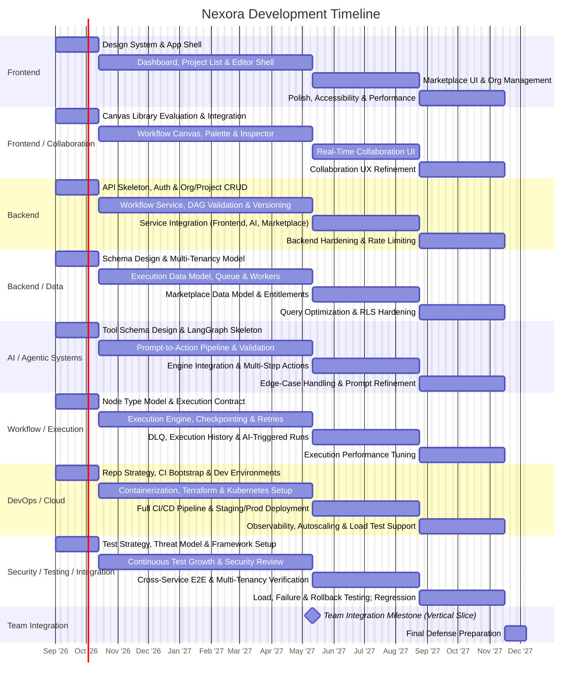
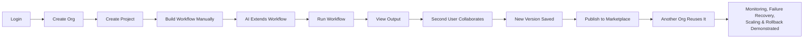

---

# 22 — MVP vs Future Work

## Guiding Principle

Nexora is scoped around a fully working MVP covering every subsystem in this documentation set, with advanced refinements documented as future work rather than removed from the project's technical narrative. No MVP component depends on a future-work item being completed.

## MVP (Must Work for the Graduation Project)

| Area | MVP Scope |
|---|---|
| Product | Organizations, projects, workflows, basic RBAC |
| Frontend | Dashboard, editor (canvas, palette, inspector), execution panel, AI assistant panel, marketplace browsing |
| Backend | API, Workflow, Execution Workers, AI, Collaboration services; REST API |
| Workflow Engine | DAG modeling, validation, versioning, async execution, checkpointing, retries |
| AI | LangGraph agent; whitelisted structured actions (create/delete/update node, connect/disconnect, set config, run workflow); schema validation and authorization |
| Real-Time Collaboration | WebSockets, server-authoritative ordering, presence, reconnection replay |
| Multi-Tenancy / Security | Organization-scoped shared schema with RLS, JWT auth, RBAC |
| Marketplace | Publishing lifecycle, listings, entitlements; payments abstracted/simulated |
| DevOps / Cloud | Docker, Kubernetes, Terraform, CI/CD, basic monitoring/logging, basic autoscaling |
| Testing | Unit, integration, E2E, load, and failure/recovery test coverage |

## Stretch Goals / Future Extensions

| Feature | Why Deferred |
|---|---|
| CRDT/OT-based collaborative editing | Server-authoritative ordering is sufficient for expected MVP concurrency; CRDT/OT adds significant design/testing cost |
| Multi-agent AI systems | Single-agent, whitelisted-action design already demonstrates the core agentic concepts required |
| Autonomous multi-step AI planning | Requires safety/guardrail work beyond a single academic year; builds on the same tool-whitelist foundation |
| Sophisticated recommendation engine (marketplace) | Not required to demonstrate the marketplace's core mechanics |
| Real payment integration | External dependency and compliance surface not central to the system's technical contribution |
| Multi-region deployment | Adds operational complexity disproportionate to the project's evaluation criteria |
| Advanced service mesh | The current service count does not yet justify mesh-level traffic management |
| Chaos engineering platform | Targeted failure injection (see [[17 - Testing Strategy]]) demonstrates the same principle at appropriate scope |
| Full distributed tracing across every hop | Basic tracing spans are MVP; exhaustive coverage is a refinement, not a new capability |

## How Stretch Goals Extend the MVP (Not Replace It)

Each stretch item builds on an existing MVP subsystem rather than requiring re-architecture:

- CRDT/OT would replace the ordering *strategy* inside the existing Collaboration Service, not its transport or connection model.
- Multi-step AI planning would add a planning layer *above* the existing whitelisted tool-call mechanism, which remains the execution boundary.
- Real payments would implement the existing `PaymentProvider` interface (see [[10 - Marketplace]]), not introduce a new one.

Related: [[02 - Requirements]], [[23 - Development Plan]], [[26 - Architectural Decision Records]]

---

# 23 — Development Plan

## Approach

All eight tracks progress through the same four lifecycle stages — **Foundation, Development, Integration, Finalization** — in parallel from day one, rather than any single track (including DevOps) occupying a dedicated phase of its own. A **Team Integration Milestone** at the end of the Development stage forces Frontend, Backend, Data, and Execution work to converge into a working vertical slice before breadth is added. This mirrors the risk-reduction reasoning in [[22 - MVP vs Future Work]]: a complete, working core system takes priority over maximum feature count.

## Timeline (Academic Year, ~11 Months)

## Stage Definitions

| Stage | Goal | Definition of Done |
|---|---|---|
| Foundation | Architecture, schemas, and tooling agreed across all tracks | Each track has a working skeleton and a frozen contract with its immediate dependents |
| Development | Core features built against frozen contracts | The Team Integration Milestone passes: a user can create, run, and reload a workflow end-to-end |
| Integration | Cross-track features (collaboration, AI, marketplace) connected to the working core | All ten subsystems in the [[README|documentation homepage]] are functionally connected |
| Finalization | Hardening, performance, and defense readiness | MVP scope in [[22 - MVP vs Future Work]] is fully met and tested |

## Dependencies Across Tracks

- AI (`a2`) depends on the Workflow Service's action-equivalent functions existing (`b2`) before AI-issued actions can be authorized and executed.
- Real-Time Collaboration (`c3`) depends on the Backend's operation-broadcast contract (`b2`/`d2`) being stable.
- DevOps (`o2`) provides the environments every other track deploys into starting in Development, not only at the end.
- Security/Testing (`q2`–`q4`) runs continuously alongside every other track rather than beginning after feature work concludes.

Related: [[24 - Team Responsibilities]], [[25 - Final Demo]], [[22 - MVP vs Future Work]]

---

# 24 — Team Responsibilities

Eight tracks, each with substantial and independent technical ownership. No single track dominates the system; DevOps/Cloud is one of eight co-equal roles.

## Responsibility Matrix

| # | Track | Responsibilities | Main Technologies | Deliverables | Depends On | Demonstrates in Final Presentation |
|---|---|---|---|---|---|---|
| 1 | Frontend | Dashboard, project/org views, marketplace UI, app shell | React, TypeScript, Router, UI components | Working authenticated app shell and non-editor screens | Backend API contracts | End-to-end navigation across a multi-tenant app |
| 2 | Frontend / Collaboration | Workflow editor canvas, node palette, inspector, live collaboration UI | React Flow, WebSocket client | Functional visual editor with live multi-user updates | Backend operation/broadcast contract | Two users editing one workflow simultaneously |
| 3 | Backend | API Service, auth, orgs/projects, Workflow Service, DAG validation, versioning | Backend framework, REST | Core API and workflow CRUD/versioning | Data schema | A validated workflow graph persisted and versioned correctly |
| 4 | Backend / Data | Database schema, multi-tenancy/RLS, execution data model, queue integration, workers | PostgreSQL, Redis, Queue | Schema, migrations, worker execution pipeline | — | An execution surviving a worker restart via checkpointing |
| 5 | AI / Agentic Systems | LangGraph agent, tool registry, structured-action schemas, validation | LangChain, LangGraph, JSON Schema | Working natural-language-to-action pipeline | Workflow Service functions | A natural-language prompt producing a validated, executed workflow change |
| 6 | Workflow / Execution | Node execution engine, checkpointing, retries, DLQ, execution history | Queue, worker runtime | Reliable async execution engine | Data model, Queue | A failed execution retried and recovered from checkpoint |
| 7 | DevOps / Cloud | Docker, Kubernetes, Terraform, CI/CD, monitoring, autoscaling, load testing support | Docker, Kubernetes, Terraform, Prometheus/Grafana | Deployed staging/production environments and pipeline | All other tracks' service contracts | A live CI/CD run from pull request to a rollback |
| 8 | Security / Testing / Integration | RBAC enforcement review, test strategy, E2E/load/failure testing, cross-track integration verification | Cypress/Playwright, k6, security scanners | Test suites and integration verification across all tracks | All other tracks | A tenant-isolation violation attempt correctly rejected |

## Continuous Involvement

- **Security/Testing** contributes from the Foundation stage (test framework, threat model) through Finalization (load/failure/rollback testing), not only at the end of the timeline — see [[23 - Development Plan]] and [[17 - Testing Strategy]].
- **DevOps/Cloud** provisions development environments and CI in the Foundation stage so every other track has a place to deploy and test against from the start, not only once features are "done."

## Ownership Boundaries

Each track owns the interfaces it exposes to others (e.g., the Workflow Service's action-equivalent functions, used identically by manual UI actions and AI-proposed actions) so that tracks can develop against a frozen contract without waiting on each other's internal implementation details.

Related: [[23 - Development Plan]], [[03 - System Architecture]], [[25 - Final Demo]]

---

# 25 — Final Demo

## Purpose

The final demonstration is a single coherent narrative touching every subsystem described in this documentation set, rather than a disconnected feature checklist.

## Demo Script

| Step | Action | Subsystem Demonstrated |
|---|---|---|
| 1 | User logs in | [[09 - Multi-Tenancy and Security]] (Authentication) |
| 2 | User creates an organization | [[09 - Multi-Tenancy and Security]] (Tenant model) |
| 3 | User creates a project | [[03 - System Architecture]] |
| 4 | User opens the workflow editor | [[04 - Frontend Architecture]] |
| 5 | User manually creates a workflow (nodes, edges) | [[06 - Workflow Engine]] |
| 6 | User asks the AI assistant to extend the workflow via natural language | [[07 - AI Architecture]] |
| 7 | AI produces structured actions | [[07 - AI Architecture]] |
| 8 | Actions are validated and authorized before applying | [[07 - AI Architecture]], [[09 - Multi-Tenancy and Security]] |
| 9 | User runs the workflow asynchronously | [[06 - Workflow Engine]] |
| 10 | A worker executes the graph | [[06 - Workflow Engine]], [[14 - Reliability and Distributed Systems]] |
| 11 | Output appears in the execution panel | [[04 - Frontend Architecture]] |
| 12 | A second user joins the same workflow | [[08 - Real-Time Collaboration]] |
| 13 | Both users collaborate in real time (live cursors/edits) | [[08 - Real-Time Collaboration]] |
| 14 | The workflow is saved as a new version | [[06 - Workflow Engine]] |
| 15 | The workflow is published to the marketplace | [[10 - Marketplace]] |
| 16 | A third user (different organization) acquires/reuses it | [[10 - Marketplace]], [[09 - Multi-Tenancy and Security]] |
| 17 | The team shows live monitoring dashboards during the run | [[15 - Observability]] |
| 18 | The team deliberately kills a worker mid-execution and shows recovery | [[14 - Reliability and Distributed Systems]], [[17 - Testing Strategy]] |
| 19 | The team generates load and shows worker autoscaling | [[13 - Scalability and Load Balancing]] |
| 20 | The team triggers a deployment and a rollback live | [[16 - CI-CD and Deployment]] |

## Narrative Diagram

## What This Demo Proves

The script is ordered so that each subsequent step depends on the previous one working, meaning a successful run through all 20 steps is itself evidence that the ten subsystems named in the [[README|documentation homepage]] operate correctly together — not in isolation.

Related: [[23 - Development Plan]], [[22 - MVP vs Future Work]]

---

# 26 — Architectural Decision Records

Each ADR follows: **Context → Decision → Alternatives → Reason → Trade-offs**.

## ADR-01: React for the Frontend

- **Context:** Need a component-based UI framework capable of a panel-based editor with a graph canvas.
- **Decision:** Use React with TypeScript.
- **Alternatives:** Vue, Svelte, Angular.
- **Reason:** Largest ecosystem of graph/canvas libraries (e.g., React Flow); team familiarity reduces ramp-up time within a fixed academic year.
- **Trade-offs:** More boilerplate than some alternatives; mitigated by a lightweight state-management approach (see [[04 - Frontend Architecture]]).

## ADR-02: REST over GraphQL

- **Context:** Client-server API style for a CRUD-heavy, well-bounded resource model.
- **Decision:** REST for the MVP.
- **Alternatives:** GraphQL.
- **Reason:** Resource boundaries (organizations, projects, workflows) map directly to REST endpoints; simpler caching, rate limiting, and operational tooling than a GraphQL gateway.
- **Trade-offs:** Less flexible for deeply nested client queries; acceptable since the editor's data needs are known and stable, not ad hoc.

## ADR-03: WebSockets for Real-Time Collaboration

- **Context:** Need low-latency, bidirectional updates for presence and live editing.
- **Decision:** WebSockets, owned exclusively by the Collaboration Service.
- **Alternatives:** HTTP long-polling, Server-Sent Events (SSE, unidirectional only).
- **Reason:** True bidirectional, low-latency communication required for both inbound operations and outbound broadcasts.
- **Trade-offs:** Requires connection-state management and reconnection handling (see [[08 - Real-Time Collaboration]]) not needed with simple request/response.

## ADR-04: PostgreSQL as the Primary Datastore

- **Context:** Need a transactional store for a strongly relational domain model (organizations, projects, workflows, versions, executions).
- **Decision:** PostgreSQL.
- **Alternatives:** MySQL, a document database (e.g., MongoDB).
- **Reason:** Strong relational modeling and transaction guarantees fit the ER model in [[18 - Database and Data Architecture]]; Row-Level Security directly supports the multi-tenancy approach in [[09 - Multi-Tenancy and Security]].
- **Trade-offs:** Less naturally flexible for deeply nested, schema-less node configuration; mitigated by using `json`/`jsonb` columns for node config where flexibility is genuinely needed.

## ADR-05: Redis for Caching and Presence

- **Context:** Need low-latency shared state across Collaboration Service instances and hot-read caching.
- **Decision:** Redis.
- **Alternatives:** In-process caching only (no cross-instance sharing), a dedicated pub/sub broker.
- **Reason:** Combines caching and pub/sub in one well-understood component, avoiding an additional piece of infrastructure.
- **Trade-offs:** Adds an operational dependency; justified because both caching and cross-instance presence broadcast are genuine MVP requirements.

## ADR-06: A Message Queue for Execution

- **Context:** Workflow execution must not block the API request path and must survive process restarts.
- **Decision:** A message queue between the Workflow Service and Execution Workers.
- **Alternatives:** In-process background tasks (no separate queue).
- **Reason:** Durable, at-least-once delivery of execution jobs, and independent scaling of workers (see [[13 - Scalability and Load Balancing]]).
- **Trade-offs:** Introduces eventual consistency between "execution requested" and "execution complete," addressed via polling/WebSocket status updates.

## ADR-07: LangGraph for Agent Orchestration

- **Context:** Need an inspectable, controllable structure for a multi-step, tool-calling AI agent.
- **Decision:** LangGraph, with LangChain for LLM/tool abstraction.
- **Alternatives:** A hand-rolled agent loop; a fully autonomous agent framework with unconstrained tool access.
- **Reason:** LangGraph's explicit state graph makes the agent's decision process inspectable and testable, and naturally supports the whitelisted-action boundary described in [[07 - AI Architecture]].
- **Trade-offs:** Adds a framework dependency and learning curve; justified by the safety and debuggability benefits for a graduation-project timeline.

## ADR-08: Structured, Whitelisted Tool Calling (Not Arbitrary Code Execution)

- **Context:** The AI agent must be able to modify workflows without becoming a source of unbounded risk.
- **Decision:** The agent may only emit actions from a fixed, registered tool set, each schema-validated and authorized before execution.
- **Alternatives:** Allowing the LLM to generate and execute arbitrary code or direct database queries.
- **Reason:** Determinism, auditability, and reuse of the same authorization path as manual UI actions (see [[07 - AI Architecture]]).
- **Trade-offs:** Limits the agent to pre-defined operations; acceptable since the MVP's goal is demonstrating safe agentic control, not open-ended autonomy.

## ADR-09: Kubernetes for Orchestration

- **Context:** Multiple independently deployable services need scaling, self-healing, and rolling deployment.
- **Decision:** Kubernetes.
- **Alternatives:** A simpler container orchestrator, or manually managed VMs.
- **Reason:** Declarative scaling and deployment primitives (Deployments, HPA, probes) match the reliability and scalability requirements in [[13 - Scalability and Load Balancing]] and [[14 - Reliability and Distributed Systems]], and are a standard, demonstrable industry skill.
- **Trade-offs:** Operational complexity for a single DevOps owner; mitigated by keeping the service count small (see ADR-12).

## ADR-10: Docker for Containerization

- **Context:** Need consistent runtime environments across development, staging, and production.
- **Decision:** Docker with multi-stage builds.
- **Alternatives:** No containerization (direct process deployment).
- **Reason:** Environment parity and a prerequisite for Kubernetes deployment.
- **Trade-offs:** None significant at this scale.

## ADR-11: Terraform for Infrastructure as Code

- **Context:** Cloud infrastructure (cluster, database, storage, cache) must be reproducible across environments.
- **Decision:** Terraform.
- **Alternatives:** Manual cloud-console provisioning.
- **Reason:** Reviewable, version-controlled infrastructure changes; ability to recreate `staging` on demand (see [[11 - DevOps Architecture]]).
- **Trade-offs:** Upfront authoring cost, offset by reduced configuration drift over the project's lifetime.

## ADR-12: A Small Number of Modular Services Instead of Many Microservices

- **Context:** Eight services could each be split further into many single-purpose microservices.
- **Decision:** Six meaningful services (API, Workflow, Execution Workers, AI, Collaboration, Marketplace), with Marketplace initially a module inside the API Service.
- **Alternatives:** A large microservice fleet with a service per resource type.
- **Reason:** Operational complexity should match team size (see [[03 - System Architecture]]); each service boundary here corresponds to a genuine scaling or ownership difference, not an arbitrary split.
- **Trade-offs:** Coarser independent-scaling granularity than a full microservice approach; acceptable since the MVP's load does not require it.

## ADR-13: Shared Database, Shared Schema for Multi-Tenancy

- **Context:** Tenant data must be isolated without excessive operational overhead for an 8-person team.
- **Decision:** Shared database, shared schema, `organization_id`-scoped queries, with PostgreSQL Row-Level Security as defense-in-depth.
- **Alternatives:** Schema-per-tenant; database-per-tenant.
- **Reason:** Lowest operational and migration overhead while still providing a genuine, demonstrable isolation mechanism (see [[09 - Multi-Tenancy and Security]]).
- **Trade-offs:** Isolation strength depends on correct query scoping at the application layer; RLS mitigates the risk of a scoping bug.

Related: [[03 - System Architecture]], [[20 - Technology Stack]], [[21 - Software Engineering Concepts]]
