# 01 — Project Overview

## Problem Statement

Building an AI-augmented automation (workflow) is currently split across disconnected tools: a visual builder for the graph, a separate chat interface for AI assistance, ad-hoc scripts for execution, and no structured way to share or monetize completed work with other users. Nexora unifies these into a single platform where workflows are created visually or via natural language, executed reliably at scale, collaborated on in real time by an organization's members, and optionally published to a marketplace for reuse.

## Product Concept

Nexora allows an authenticated user, acting within an **organization**, to:

- Create a **project** and, within it, one or more **workflows**.
- Build a workflow visually as a directed acyclic graph (DAG) of **nodes** connected by **edges**.
- Configure each node (inputs, parameters, connected external services).
- Run a workflow and inspect per-node outputs and execution history.
- Ask an **AI agent** to create or modify the workflow using natural language; the agent proposes structured, schema-validated actions rather than editing state directly.
- Collaborate with other organization members on the same workflow in real time, seeing presence and live changes.
- Save and version workflows, and roll back to a previous version.
- **Publish** a workflow to the marketplace, and **reuse or acquire** workflows published by others.
- Manage organization membership and role-based permissions.

## Non-Goals for the Graduation Project

Nexora does not attempt to be a general-purpose enterprise iPaaS. The following are explicitly out of scope for the academic delivery (see [[22 - MVP vs Future Work]] for the full boundary):

- Fully autonomous, unsupervised multi-step AI agents.
- Production-grade payment processing.
- Multi-region, globally distributed deployment.
- Conflict-free replicated collaborative editing (CRDT/OT).

## System at a Glance

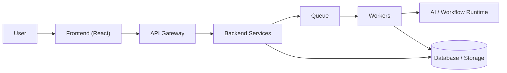

See [[03 - System Architecture]] for the complete architecture and [[06 - Workflow Engine]] and [[07 - AI Architecture]] for the two subsystems that give the project its technical depth.

## Document Index

This overview is the entry point into the full documentation set; see the [[README|documentation homepage]] for the complete map.


---

# 02 — Requirements

## Functional Requirements

| ID | Requirement | MVP? |
|---|---|---|
| FR-1 | Users can register, authenticate, and manage a profile | Yes |
| FR-2 | Users can create and join organizations | Yes |
| FR-3 | Organization admins can invite members and assign roles | Yes |
| FR-4 | Users can create projects within an organization | Yes |
| FR-5 | Users can create workflows within a project | Yes |
| FR-6 | Users can add, configure, connect, and remove workflow nodes | Yes |
| FR-7 | Users can execute a workflow and view per-node outputs | Yes |
| FR-8 | Workflow executions are versioned and their history is retained | Yes |
| FR-9 | Users can invoke an AI agent to create or modify a workflow via natural language | Yes |
| FR-10 | AI-proposed actions are schema-validated and authorized before execution | Yes |
| FR-11 | Multiple users can edit the same workflow concurrently with visible presence | Yes |
| FR-12 | Workflow operations from one collaborator are broadcast to others in real time | Yes |
| FR-13 | Users can publish a workflow version to a marketplace listing | Yes |
| FR-14 | Users can browse, acquire, and reuse marketplace workflows | Yes |
| FR-15 | Failed executions are retried with backoff and moved to a dead-letter queue after exhausting retries | Yes |
| FR-16 | Users can comment on workflows | Stretch |
| FR-17 | Marketplace purchases are processed through a real payment provider | Stretch |
| FR-18 | Concurrent edits are merged via CRDT/OT instead of server-ordered sequencing | Stretch |

## Non-Functional Requirements

| Category | Requirement |
|---|---|
| Security | All API access is authenticated; all resource access is authorized against organization/role membership |
| Multi-Tenancy | One organization's data must never be visible to another organization |
| Reliability | Workflow execution failures must not silently lose work; retries and a dead-letter queue are mandatory |
| Scalability | API and worker components must scale horizontally and independently |
| Observability | The system must expose metrics, structured logs, and health endpoints sufficient to diagnose a production incident |
| Testability | Core business logic (validation, authorization, workflow execution, AI action handling) must be covered by automated tests |
| Maintainability | Business-critical validation and authorization must live in the backend, never solely in the frontend |

## Actors

| Actor | Description |
|---|---|
| End User | Authenticated individual who creates and runs workflows |
| Organization Admin | User with elevated permissions over an organization's members and settings |
| Collaborator | Any organization member with edit access to a shared workflow |
| AI Agent | System-internal actor that proposes structured workflow actions; never a privileged actor — every action it proposes is authorized as if performed by the requesting user |
| Marketplace Consumer | User acquiring/reusing a workflow published by another organization |

## Constraints

- Delivery window is a single academic year with an 8-person team (see [[24 - Team Responsibilities]]).
- The AI component must not execute arbitrary code or directly mutate the database; see [[07 - AI Architecture]].
- Cloud provider is not fixed in advance; infrastructure is described in provider-agnostic terms where practical (see [[11 - DevOps Architecture]]).

> [!note] Decision Pending
> The specific LLM provider (e.g., a hosted API vs. a self-hosted model) is not fixed at this stage and does not affect the architecture, since the AI Service treats the LLM as a replaceable component behind a single interface.

Related: [[01 - Project Overview]], [[22 - MVP vs Future Work]], [[03 - System Architecture]]


---

# 03 — System Architecture

## Architectural Style

Nexora is a **modular backend** deployed as a small number of independently deployable services, not a large microservice fleet. Synchronous request/response traffic goes through an API layer; long-running or resource-intensive work (workflow execution, AI reasoning) is offloaded to asynchronous workers via a queue. This keeps the system easy for an 8-person team to reason about while still demonstrating real distributed-systems concerns (see [[14 - Reliability and Distributed Systems]]).

## Overall System Diagram

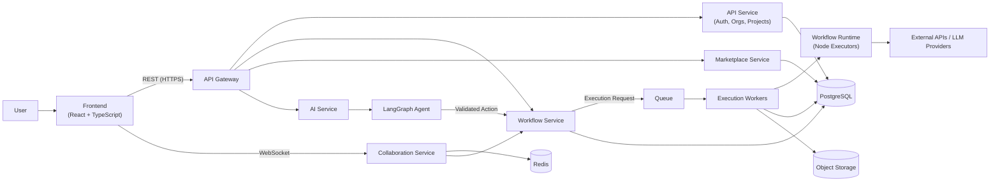

## Service Responsibilities

| Service | Responsibility | Independently Deployable? |
|---|---|---|
| API Service | Authentication, organizations, projects, membership, RBAC | Yes |
| Workflow Service | Workflow CRUD, versioning, DAG validation, execution requests | Yes |
| Execution Workers | Pull execution jobs from the queue and run node graphs | Yes (scales independently of API) |
| AI Service | Hosts the LangGraph agent; produces structured, validated actions | Yes |
| Collaboration Service | WebSocket connections, presence, operation broadcast | Yes |
| Marketplace Service | Listings, entitlements, publishing lifecycle | Can start as a module inside the API Service; split out only if load or team ownership requires it |

> [!note]
> The Marketplace Service is the one component explicitly allowed to begin as a module rather than a separate deployment, since its request volume is expected to be low relative to workflow execution. See [[26 - Architectural Decision Records]] for the reasoning.

## Cross-Cutting Concerns

- **Authentication & Authorization:** every request through the API Gateway is authenticated and authorized before reaching a service — see [[09 - Multi-Tenancy and Security]] and [[19 - API Architecture]].
- **Asynchronous Execution:** the queue/worker split isolates slow or failure-prone work (workflow runs, AI calls) from the request/response path — see [[06 - Workflow Engine]] and [[14 - Reliability and Distributed Systems]].
- **Observability:** all services emit metrics, structured logs, and health endpoints — see [[15 - Observability]].
- **Deployment:** all services are containerized and deployed to a shared Kubernetes cluster — see [[11 - DevOps Architecture]] and [[12 - Infrastructure and Kubernetes]].

## Authentication / Authorization Flow

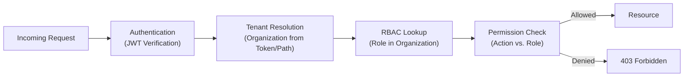

Related: [[05 - Backend Architecture]], [[09 - Multi-Tenancy and Security]], [[19 - API Architecture]]


---

# 04 — Frontend Architecture

## Design Principle

The frontend is kept as simple as it can be while remaining powerful enough for a graph-based editor and real-time collaboration. It introduces no framework or library without an explicit architectural reason, and it is **not the source of truth**: all business-critical validation and authorization are enforced by the backend (see [[05 - Backend Architecture]], [[09 - Multi-Tenancy and Security]]). The frontend may perform optimistic UI updates, but every mutation is re-validated server-side.

## Technology Choices

| Technology | Why It Is Used |
|---|---|
| React + TypeScript | Component model suited to a panel-based editor UI; static typing reduces integration errors against backend contracts |
| A routing solution (React Router) | Standard client-side navigation between dashboard, projects, editor, and marketplace views |
| A graph/workflow editor library (e.g., React Flow) | Provides canvas, node, and edge rendering/interaction primitives so the team does not build a graph renderer from scratch |
| A UI component library | Consistent, accessible baseline components (forms, dialogs, panels), avoiding bespoke design-system work outside the project's scope |
| HTTP client | Typed wrapper over REST calls to the API Gateway |
| WebSocket client | Persistent connection to the Collaboration Service for presence and live operations |
| Lightweight state management (e.g., a minimal store plus server-state caching) | Separates local UI state from server state; avoids a heavyweight global-state framework the team does not need |

> [!note] Decision Pending
> The exact UI component library and state-management library are implementation choices left to the Frontend track; neither affects the architecture described in this document.

## Application Areas

| Area | Purpose |
|---|---|
| Dashboard | Entry point showing the user's organizations and recent projects |
| Project List | Projects within the current organization |
| Workflow Editor | Canvas, node palette, inspector, execution panel — the core authoring surface |
| Workflow Canvas | Renders nodes/edges; source of user-issued graph operations |
| Node Palette | Catalog of available node types to drag onto the canvas |
| Inspector / Configuration Panel | Edits the selected node's parameters |
| Execution / Output Panel | Shows run status, per-node output, and execution history |
| AI Assistant | Natural-language interface that submits prompts to the AI Service and renders proposed actions |
| Collaboration Indicators | Presence avatars and live cursors/selection for other connected users |
| Marketplace | Browse, view, and acquire published workflows |
| Organization / Team Management | Membership, roles, and invitations |

## Editor Layout

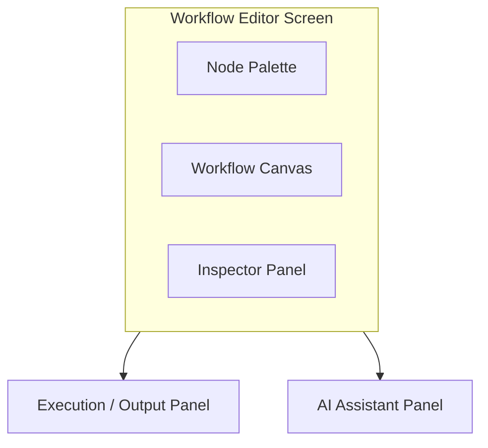

## Data Flow

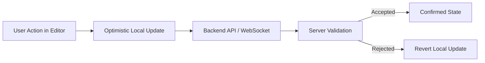

Because validation and authorization live entirely on the backend, the frontend can be re-implemented (e.g., a different editor library) without altering system correctness — a deliberate separation of concerns.

Related: [[05 - Backend Architecture]], [[08 - Real-Time Collaboration]], [[07 - AI Architecture]]


---

# 05 — Backend Architecture

## Service Decomposition

Nexora deliberately uses a **small number of meaningful services** rather than a large microservice fleet, so that operational complexity remains proportional to an 8-person team (see [[03 - System Architecture]] for the full diagram).

| Service | Owns | Deployment |
|---|---|---|
| API Service | Auth, organizations, projects, membership | Independent |
| Workflow Service | Workflow/version CRUD, DAG validation, execution requests | Independent |
| Execution Workers | Running workflow graphs pulled from the queue | Independent, scales separately from API |
| AI Service | LangGraph agent, tool registry, action validation | Independent |
| Collaboration Service | WebSocket connections, presence, operation broadcast | Independent |
| Marketplace Service | Listings, entitlements, publishing lifecycle | Starts as a module inside the API Service (see [[26 - Architectural Decision Records]]) |

## REST vs. GraphQL

Nexora's resource model (organizations, projects, workflows, nodes, executions) is CRUD-heavy with well-defined resource boundaries, which REST expresses directly and simply. GraphQL's main benefit — flexible client-driven queries across nested resources — matters less here than operational simplicity and cacheability. **REST is used for the MVP**; see [[26 - Architectural Decision Records]] for the full trade-off discussion.

## Core Backend Concerns

| Concern | Approach |
|---|---|
| Authentication | JWT access/refresh tokens issued by the API Service |
| Authorization | RBAC middleware resolving organization membership and role before every request reaches business logic |
| Validation | Schema validation (request bodies, workflow graphs, AI-proposed actions) at the service boundary, before persistence |
| Database Access | A single access layer per service; no service queries another service's tables directly |
| Transactions | Multi-row mutations (e.g., creating a workflow version and its nodes/edges) are wrapped in a single database transaction |
| WebSockets | Owned exclusively by the Collaboration Service; other services publish events to it rather than holding connections themselves |
| Rate Limiting | Per-user/per-organization token-bucket limits at the API Gateway |
| Idempotency | Execution-triggering requests accept an idempotency key so retried client requests do not duplicate work (see [[14 - Reliability and Distributed Systems]]) |
| Error Handling | Uniform error envelope (code, message, field errors) returned by every service; internal errors never leak stack traces to clients |
| Async Processing | Workflow execution and AI reasoning are queued rather than handled inline in the request/response cycle |

## Request Lifecycle (Synchronous Path)

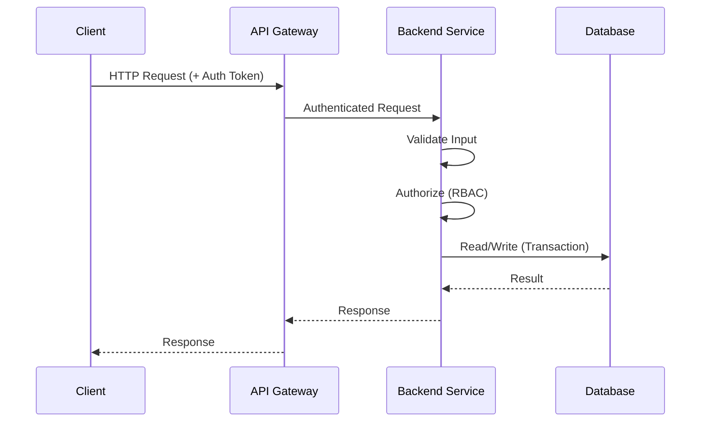

## Asynchronous Path

Workflow execution and AI reasoning follow the queue/worker pattern described in [[06 - Workflow Engine]] and [[07 - AI Architecture]], rather than blocking a request thread.

Related: [[03 - System Architecture]], [[18 - Database and Data Architecture]], [[19 - API Architecture]]


---

# 06 — Workflow Engine

## Workflow Representation

A **Workflow** is a directed acyclic graph (DAG):

```
Workflow → Nodes → Edges → Configuration → Version
```

Each saved copy of a workflow's graph is an immutable **WorkflowVersion**; editing a workflow produces a new draft version rather than mutating history in place. This directly supports the versioning, rollback, and marketplace-publishing requirements (see [[02 - Requirements]], [[10 - Marketplace]]).

## Node Types (MVP)

| Type | Examples | Notes |
|---|---|---|
| Trigger | Manual run, incoming webhook | Entry point of the graph; a workflow has exactly one trigger for the MVP |
| Action | HTTP request, LLM call, web search | Performs an external effect or call |
| Transform | Map, filter, template/string interpolation | Pure data transformation between nodes |
| Output | Store result, return to caller | Terminal node(s) of the graph |

> [!note] Decision Pending
> The exact catalog of built-in Action node integrations (which external APIs are supported out of the box) is an implementation detail to be finalized during development, not an architectural decision.

## DAG Validation

Before a version is saved or executed, the Workflow Service validates that:

- The graph contains no cycles.
- Every node's required inputs are connected or configured.
- Every edge connects compatible node output/input types.
- The graph contains exactly one trigger and at least one reachable output.

## Execution Model

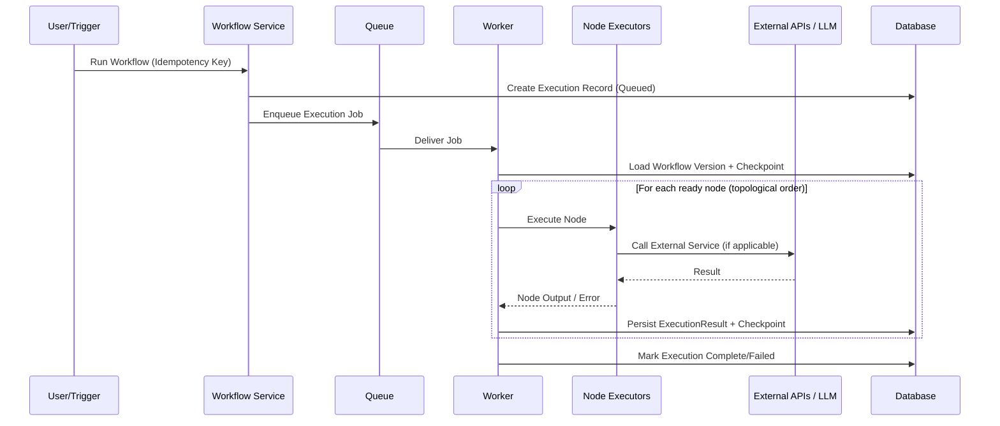

## Execution State

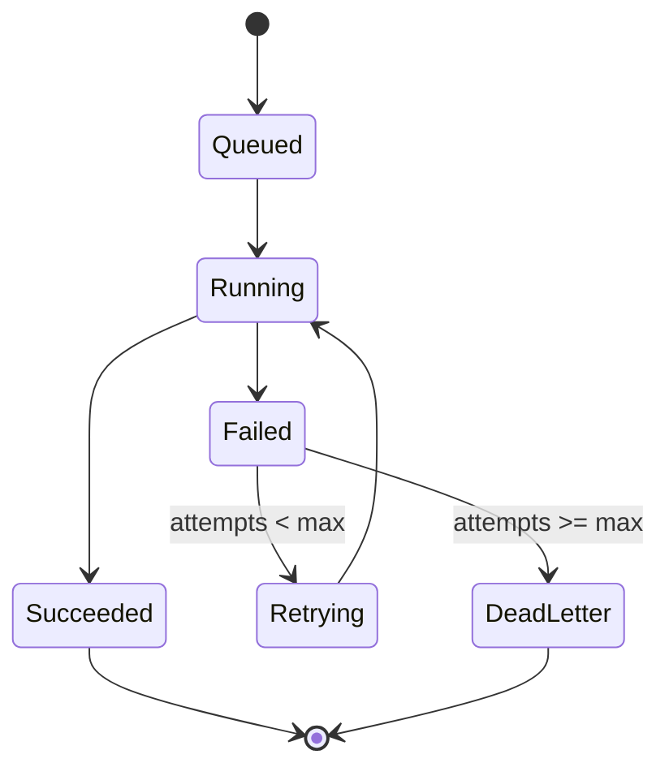

## Checkpointing and Retries

Each node's result is persisted as it completes. If an execution fails partway through, a retry resumes from the **last successfully completed node** rather than restarting the entire graph, using the stored checkpoint. Retries use exponential backoff up to a configured maximum; executions that exceed the maximum are moved to a dead-letter queue for manual inspection (see [[14 - Reliability and Distributed Systems]]).

## Versioning and History

- Every execution references the specific `WorkflowVersion` it ran, so historical runs remain reproducible even after the workflow is edited further.
- Execution history (status, duration, per-node results) is retained and browsable from the Execution/Output Panel (see [[04 - Frontend Architecture]]).

Related: [[07 - AI Architecture]] (which proposes graph mutations through the same validation path), [[14 - Reliability and Distributed Systems]], [[18 - Database and Data Architecture]]


---

# 07 — AI Architecture

## Design Principle

The AI agent is a **bounded, deterministic actor**, not an unrestricted autonomous system. It never modifies application state directly and never executes arbitrary code. Every effect it produces passes through the same structured-action validation and authorization path used by manual UI operations (see [[06 - Workflow Engine]], [[09 - Multi-Tenancy and Security]]).

```
Natural Language → Agent → Structured Action → Schema Validation → Authorization → Function/Tool Call → Application State Update → Result
```

## Responsibilities of Each Component

| Component | Responsibility |
|---|---|
| LangChain | Provides the LLM abstraction layer, prompt templating, and tool-wrapping utilities used to expose backend functions to the agent |
| LangGraph | Orchestrates the agent as an explicit **state graph**: interpret prompt → gather context → decide action → propose structured action → await validation/authorization result → update conversation state → respond |
| LLM | Interprets natural language and context, and selects/populates a structured action from the registered tool set; it does not execute the action itself |
| Tools | Explicitly registered functions (e.g., `create_node`) that the agent may request; the agent has no access to any function not registered as a tool |
| Structured Actions | JSON objects conforming to a fixed schema per action type, produced by the LLM in place of free-form text |
| Validator | Checks a proposed action against its JSON Schema and the current workflow's DAG constraints before it is allowed to execute |
| Authorization Layer | Confirms the requesting user has permission to perform the equivalent manual action, exactly as if they had used the UI |

## Why the LLM Never Modifies the Database or Executes Code Directly

- **Determinism and auditability:** every mutation must be traceable to a validated, schema-conformant action, not to unconstrained model output.
- **Safety:** an LLM producing arbitrary code or raw queries could not be reliably sandboxed within this project's scope.
- **Consistency:** routing AI actions through the same backend functions used by the UI guarantees the same invariants (DAG validity, authorization, versioning) apply regardless of the action's origin.

## Agent Execution Flow

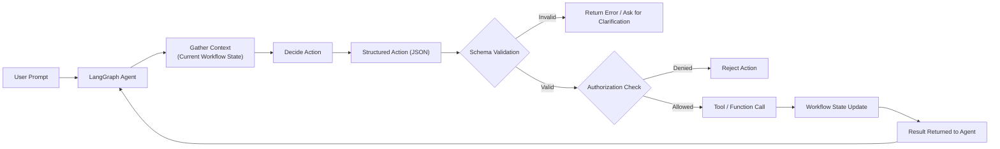

## Agent State Machine (LangGraph)

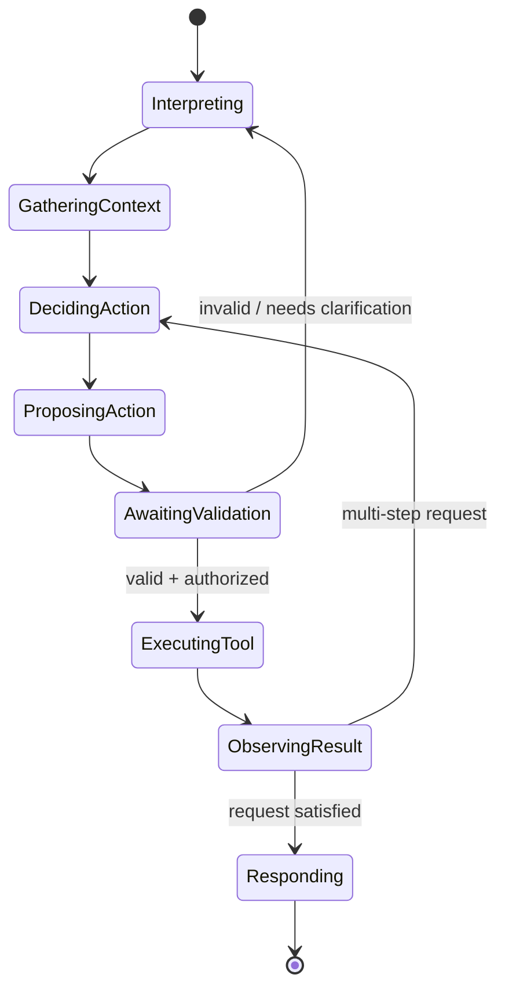

## Registered Tools (MVP)

| Tool | Effect |
|---|---|
| `create_node` | Adds a node of a given type/config to the current draft version |
| `delete_node` | Removes a node and its connected edges |
| `update_node` | Changes a node's configuration |
| `connect_nodes` | Adds an edge between two nodes |
| `disconnect_nodes` | Removes an edge |
| `set_node_config` | Sets specific configuration fields on a node |
| `run_workflow` | Triggers an execution of the current draft version |

## Example: Structured Action Schema

```json
{
  "action": "create_node",
  "parameters": {
    "workflow_id": "wf_123",
    "node_type": "action.web_search",
    "config": {
      "query_template": "{{input.topic}}"
    }
  },
  "requested_by": "agent",
  "conversation_id": "conv_456"
}
```

## Example: Multi-Step Prompt

**User:** "Create a workflow that searches the web and summarizes the results."

**Agent-proposed action sequence:**

```json
[
  { "action": "create_node", "parameters": { "node_type": "trigger.manual" } },
  { "action": "create_node", "parameters": { "node_type": "action.web_search" } },
  { "action": "create_node", "parameters": { "node_type": "action.llm_summarize" } },
  { "action": "connect_nodes", "parameters": { "from": "trigger", "to": "web_search" } },
  { "action": "connect_nodes", "parameters": { "from": "web_search", "to": "llm_summarize" } }
]
```

Each action in the sequence is validated and authorized independently before being applied; a failure partway through halts the sequence and reports which actions succeeded.

## Error Handling and Tool Results

If validation or authorization fails, the agent receives a structured error (not a raw exception) and can either ask the user for clarification or abandon the request. Successful tool calls return their result to the agent's state so subsequent steps in a multi-step request can reference prior outputs (e.g., a newly created node's ID).

## Conversation and Workflow State

The agent maintains conversation state (LangGraph's graph state) scoped to a single editing session, separate from the workflow's own persisted state in the database. This separation means a conversation can be abandoned without side effects, since only validated, authorized actions ever reach persisted workflow state.

Related: [[06 - Workflow Engine]], [[08 - Real-Time Collaboration]] (AI-issued actions are broadcast to collaborators the same way user actions are), [[09 - Multi-Tenancy and Security]]


---

# 08 — Real-Time Collaboration

## Scope for the MVP

Multiple users from the same organization can edit the same workflow concurrently, see who else is online, and see each other's changes as they happen. Conflict resolution uses a **server-authoritative** model: the Collaboration Service is the single source of ordering truth for a given workflow. This is intentionally simpler than CRDT/OT-based merging, which is documented as a future enhancement (see [[22 - MVP vs Future Work]]) rather than an MVP dependency.

## Connection Lifecycle

1. Client authenticates and opens a WebSocket connection to the Collaboration Service, specifying the workflow it wants to join.
2. The service verifies the user's authorization to access that workflow (via the same RBAC check used by REST requests).
3. The service registers the client's presence and broadcasts a "user joined" event to other connected collaborators.
4. On disconnect (including network drop), the service broadcasts a "user left" event and, on reconnection, replays any operations the client missed since its last acknowledged sequence number.

## Message Flow

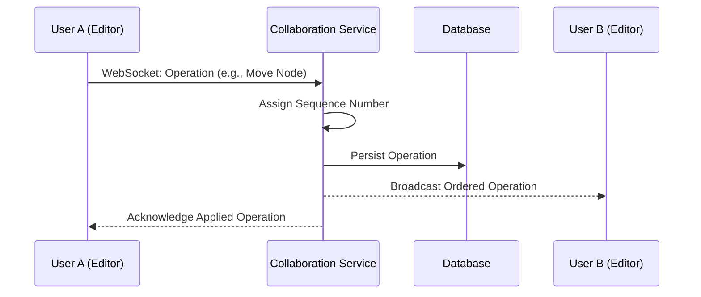

## Event Types

| Event | Direction | Purpose |
|---|---|---|
| `presence.join` / `presence.leave` | Server → Clients | Track who is currently viewing/editing a workflow |
| `operation.submit` | Client → Server | Propose a graph mutation (move/add/delete node, connect/disconnect edge, config change) |
| `operation.broadcast` | Server → Clients | Ordered, persisted operation delivered to all other connected collaborators |
| `operation.ack` | Server → Originating Client | Confirms an operation was accepted and its assigned sequence number |
| `comment.added` | Server → Clients | New comment on the workflow (stretch goal, see [[02 - Requirements]]) |

## Ordering and Persistence

Every accepted operation is assigned a monotonically increasing sequence number scoped to its workflow and persisted before being broadcast, so a client that reconnects can request "operations since sequence N" and replay them to reach a consistent state without a full reload.

## Reconnection Handling

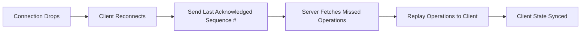

## Conflict Handling (MVP)

Because the server assigns a single order to all operations on a given workflow, two simultaneous edits are resolved by whichever operation the server sequences first; the second is applied on top of the already-updated state (last-write-wins at the level of individual node/edge fields, not whole-document overwrite). This is sufficient for the collaboration patterns expected in a graduation-project demo (a handful of concurrent editors) without the implementation cost of CRDT/OT.

> [!note] Future Work
> CRDT- or OT-based merging would allow true concurrent, conflict-free edits (including offline edits) and is documented as a stretch goal in [[22 - MVP vs Future Work]].

## AI-Issued Operations

Actions produced by the AI agent (see [[07 - AI Architecture]]) are applied through the same operation path as manually issued ones, so all collaborators see AI-driven changes live, with the same ordering and persistence guarantees.

Related: [[06 - Workflow Engine]], [[09 - Multi-Tenancy and Security]], [[04 - Frontend Architecture]]


---

# 09 — Multi-Tenancy and Security

## Tenant Model

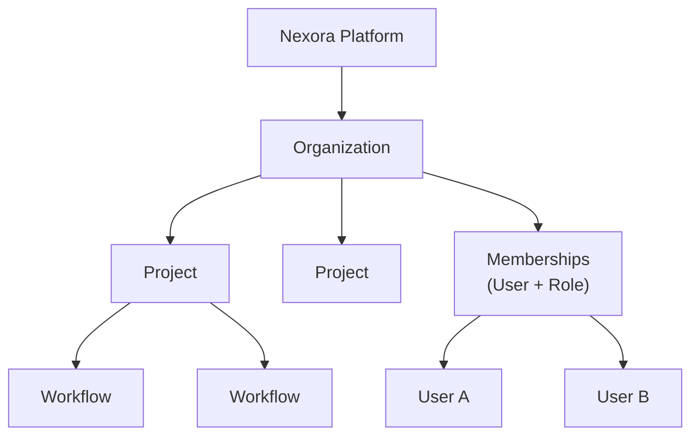

The **Organization** is the tenant boundary. A **Project** groups related workflows within an organization. A **Membership** links a user to an organization with a **role** that determines permissions. A `Team` sub-grouping within larger organizations is a plausible future refinement but is not required for the MVP tenant model (see [[22 - MVP vs Future Work]]).

## Roles and Permissions (MVP)

| Role | Typical Permissions |
|---|---|
| Owner | Full control, including billing/organization deletion |
| Admin | Manage members, projects, and workflows |
| Editor | Create/edit workflows within assigned projects |
| Viewer | Read-only access to workflows and execution results |

Permission checks are enforced **on every API request** by the RBAC middleware described in [[03 - System Architecture]] and [[19 - API Architecture]] — never assumed from frontend state.

## Tenant Isolation Strategies (Comparison)

| Strategy | Isolation Strength | Operational Overhead | Migration Complexity |
|---|---|---|---|
| Shared database, shared schema (tenant_id column) | Moderate — relies on correct query scoping | Low | Low |
| Shared database, separate schema per tenant | Strong | Moderate | Moderate (schema per tenant to migrate) |
| Separate database per tenant | Strongest | High | High |

**Recommendation for the MVP: shared database, shared schema**, with every tenant-scoped table carrying an `organization_id` column, every query scoped by it at the application layer, and PostgreSQL **Row-Level Security (RLS)** policies as defense-in-depth against an application-layer scoping bug. This keeps operational overhead low enough for an 8-person team while still demonstrating a genuine tenant-isolation mechanism. Schema-per-tenant or database-per-tenant are documented as scaling paths if stronger isolation is later required (see [[26 - Architectural Decision Records]]).

## Enforcement Points

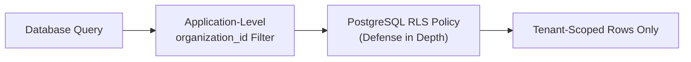

## Security Practices

| Area | Practice |
|---|---|
| Authentication | JWT access/refresh tokens; passwords hashed with a modern algorithm (e.g., bcrypt/argon2) |
| Authorization | RBAC middleware on every request; resource ownership re-checked at the data-access layer, not only at the route level |
| Transport | TLS everywhere; no plaintext internal traffic between services in production |
| Secrets | Managed via Kubernetes Secrets / a secrets manager, never committed to source control (see [[11 - DevOps Architecture]]) |
| Input Validation | All request bodies and AI-proposed actions validated against a schema before use (see [[07 - AI Architecture]], [[19 - API Architecture]]) |
| Auditability | Sensitive mutations (membership changes, role changes, marketplace publishing) are logged with actor, action, and timestamp |

Related: [[03 - System Architecture]], [[18 - Database and Data Architecture]], [[07 - AI Architecture]]


---

# 10 — Marketplace

## Purpose

The marketplace lets organizations publish finished workflows for other users to discover, reuse, or acquire, turning individually built automations into shared, reusable assets.

## Core Concepts

| Concept | Description |
|---|---|
| MarketplaceListing | A published, browsable reference to a specific `WorkflowVersion` (immutable snapshot) |
| Ownership | The organization/user that created the original workflow retains authorship attribution |
| Entitlement | A record granting a specific user/organization the right to import a copy of a listed workflow into their own projects |
| Publishing Lifecycle | Draft → Submitted → Listed → (optionally) Delisted |

## Publishing Lifecycle

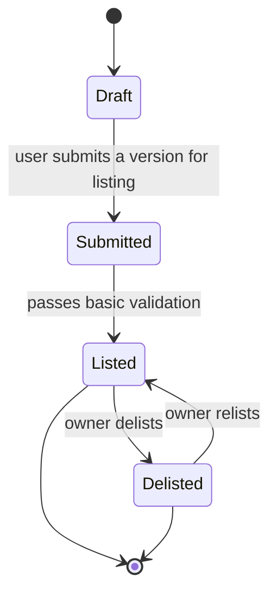

## Acquisition Flow

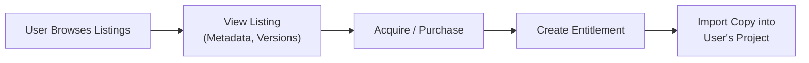

Acquiring a listed workflow creates an independent copy in the acquiring organization's project space; the original listing is unaffected, and future edits by either party do not propagate to the other, keeping ownership and versioning unambiguous.

## Payments

> [!note] Decision Pending
> Real payment processing is treated as **out of MVP scope** (see [[22 - MVP vs Future Work]]). The Marketplace Service depends on an abstract `PaymentProvider` interface with a single method (e.g., `charge(entitlement_request)`); the MVP implementation can simulate a successful charge or support free listings only, without changing any other component if a real provider (e.g., a hosted checkout) is integrated later.

## What Is Tracked

| Entity | Purpose |
|---|---|
| MarketplaceListing | Published metadata: title, description, referenced `WorkflowVersion`, publishing status |
| Purchase / Entitlement | Record of who acquired what, and when |
| Comment | Optional user feedback on a listing (stretch goal) |

## Access Control

Publishing and delisting are restricted to organization roles with sufficient permission on the source workflow (see [[09 - Multi-Tenancy and Security]]); acquiring a listing only requires standard authenticated access, independent of the acquiring user's role in the *source* organization.

Related: [[06 - Workflow Engine]] (versions are the unit of publishing), [[18 - Database and Data Architecture]], [[22 - MVP vs Future Work]]


---

# 11 — DevOps Architecture

## Role in the System

DevOps provides the deployment, automation, and operational foundation that lets the frontend, backend, workflow engine, AI service, and collaboration service run together as one deployed system. It is one of ten subsystems described in this documentation set (see the [[README|homepage]]) and is owned by a single team member with real engineering scope — not reduced to "run `docker push`."

## Containerization

Each service (API, Workflow, AI, Collaboration, Marketplace, Workers, Frontend) is built as its own container image using **multi-stage Docker builds**: a build stage compiles/installs dependencies, and a minimal runtime stage carries only what is needed to run, keeping images small. Images run as **non-root** users, define **health-check** endpoints, and receive configuration exclusively through environment variables/mounted config, never baked into the image.

## Kubernetes

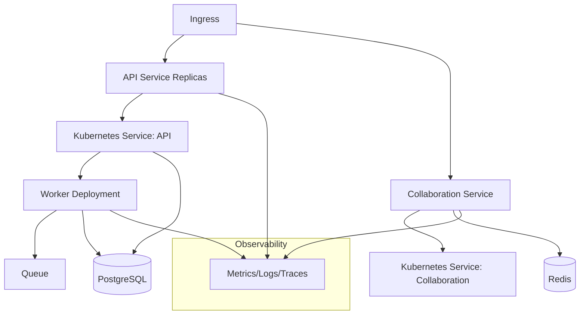

Each service is deployed as a Kubernetes **Deployment** fronted by a **Service**; environment-specific values live in **ConfigMaps**, and credentials in **Secrets**. **Namespaces** separate `staging` from `production`. Every Deployment declares resource **requests/limits** and **liveness/readiness probes** so Kubernetes can make correct scheduling and restart decisions.

## Infrastructure as Code

Infrastructure (cluster, networking, managed PostgreSQL, object storage, Redis) is provisioned with **Terraform**, giving the team reproducible environments, code-reviewable infrastructure changes, and the ability to tear down and recreate `staging` on demand rather than hand-configuring cloud resources.

> [!note] Decision Pending
> A specific cloud provider is not fixed in this documentation; the Terraform modules are structured so that provider-specific resources are isolated behind a small set of modules (cluster, database, storage, cache), limiting the blast radius of a later provider decision.

## Deployment Pipeline (Summary)

The full pipeline from pull request to production is described in [[16 - CI-CD and Deployment]]. In summary: pull request → automated tests/lint/security scan → image build → registry push → staging deployment → production deployment (with rollback capability).

## Scaling, Observability, and Reliability

Detailed separately so DevOps does not absorb every operational concern into a single oversized document:

- Horizontal scaling and load balancing: [[13 - Scalability and Load Balancing]]
- Distributed-systems reliability mechanisms: [[14 - Reliability and Distributed Systems]]
- Metrics, logs, traces, dashboards, alerts: [[15 - Observability]]
- Full CI/CD pipeline: [[16 - CI-CD and Deployment]]
- Load, failure, and rollback testing: [[17 - Testing Strategy]]

## Cluster Topology Reference

Kubernetes resource layout is detailed in [[12 - Infrastructure and Kubernetes]].

Related: [[03 - System Architecture]], [[24 - Team Responsibilities]]


---

# 12 — Infrastructure and Kubernetes

This document details the Kubernetes resource layout introduced at a high level in [[11 - DevOps Architecture]].

## Namespace Layout

| Namespace | Purpose |
|---|---|
| `nexora-staging` | Pre-production validation environment |
| `nexora-production` | Production environment |
| `nexora-observability` | Shared monitoring stack (metrics, dashboards, log aggregation) |

## Resource Layout

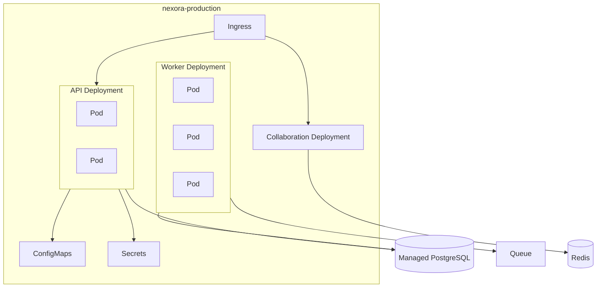

## Per-Service Configuration

| Setting | Purpose |
|---|---|
| Resource requests/limits | Guarantee minimum scheduling capacity and cap runaway resource usage per pod |
| Liveness probe | Restarts a pod that has become unresponsive |
| Readiness probe | Removes a pod from load-balancing until it can actually serve traffic |
| ConfigMap | Non-secret configuration (feature flags, external endpoints) |
| Secret | Database credentials, JWT signing keys, third-party API keys |

## Ingress

A single Ingress controller routes `/api/*` to the API Service, `/ws` to the Collaboration Service, and static frontend assets to a CDN or the frontend's own deployment, terminating TLS at the edge.

## Environment Promotion

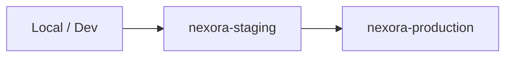

Terraform provisions the underlying cluster and managed services (database, cache, storage) for each environment from the same modules, with environment-specific variable files, so `staging` and `production` are structurally identical and drift is minimized.

Related: [[11 - DevOps Architecture]], [[13 - Scalability and Load Balancing]], [[16 - CI-CD and Deployment]]


---

# 13 — Scalability and Load Balancing

## Independent Scaling Axes

The API Service and Execution Workers scale independently because their load profiles differ: API load tracks concurrent users, while worker load tracks queued execution jobs. Decoupling them (see [[03 - System Architecture]]) means a burst of workflow executions does not require scaling — or does not starve — the interactive API path.

## Horizontal Scaling

| Component | Scaling Trigger |
|---|---|
| API Service | CPU/memory utilization, request rate |
| Collaboration Service | Active WebSocket connection count |
| Execution Workers | Queue depth (primary signal) |

## Autoscaling Flow

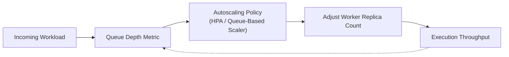

For the MVP, Kubernetes' **Horizontal Pod Autoscaler (HPA)** scales the API Service on CPU utilization, and the Worker Deployment on queue depth (via a custom metric or a queue-aware autoscaler). More sophisticated autoscaling (e.g., predictive scaling, cost-aware policies) is documented as future work in [[22 - MVP vs Future Work]].

## Load Balancing

The Ingress controller load-balances incoming HTTP traffic across API Service replicas; the Collaboration Service is load-balanced at connection time, with each WebSocket pinned to the replica that accepted it for the life of that connection (sticky by connection, not by request).

## Caching

Redis caches frequently read, rarely changed data (e.g., organization membership lookups used on every authorization check) to reduce database load under scale, with a short TTL and explicit invalidation on membership changes.

## Database Scaling Considerations

For the MVP, a single managed PostgreSQL instance (with read replicas as a documented, not yet implemented, option) is sufficient given the expected graduation-project load. Sharding or multi-region database topologies are explicitly out of scope (see [[22 - MVP vs Future Work]]).

Related: [[11 - DevOps Architecture]], [[14 - Reliability and Distributed Systems]], [[06 - Workflow Engine]]


---

# 14 — Reliability and Distributed Systems

## Why This Matters

Workflow execution spans multiple asynchronous steps (queue → worker → node executors → external APIs), each of which can fail independently. Nexora treats partial failure as an expected condition, not an edge case, and applies standard distributed-systems mechanisms to recover from it.

## Retry with Backoff

```mermaid
flowchart LR
    Job["Job"] --> Worker["Worker"]
    Worker -- "Failure" --> Retry{"Attempts < Max?"}
    Retry -- "Yes" --> Backoff["Exponential Backoff"]
    Backoff --> Worker
    Retry -- "No" --> DLQ["Dead Letter Queue"]
```

Each execution attempt that fails is retried with exponential backoff (e.g., 1s, 2s, 4s, ...) up to a configured maximum attempt count. Exceeding the maximum moves the job to a **Dead Letter Queue (DLQ)** for manual inspection rather than retrying indefinitely.

## Idempotency

```mermaid
flowchart LR
    Req["Execution Request<br/>+ Idempotency Key"] --> Check{"Key Already Seen?"}
    Check -- "Yes" --> Stored["Return Stored Result"]
    Check -- "No" --> Process["Process Once"]
    Process --> Save["Store Result Under Key"]
    Save --> Return["Return Result"]
```

Every execution-triggering request accepts a client-supplied idempotency key. If a client retries the same request (e.g., after a timeout with an unclear outcome), the Workflow Service returns the original result instead of starting a duplicate execution — necessary because retried *requests* and retried *executions* are different concerns and both must be handled without duplicating side effects.

## Checkpointing

As described in [[06 - Workflow Engine]], each node's output is persisted as it completes, so a retried execution resumes from the last successful node rather than re-running already-completed, potentially side-effecting steps (e.g., an external API call that should not be repeated).

## Health Checks and Graceful Shutdown

- **Liveness/readiness probes** (see [[12 - Infrastructure and Kubernetes]]) let Kubernetes detect and replace unhealthy pods automatically.
- On shutdown (e.g., during a rolling deployment), workers finish or safely checkpoint in-flight jobs before exiting, rather than dropping them mid-execution.

## Backup and Recovery

PostgreSQL is backed up on a scheduled basis (managed-service automated backups for the MVP), with a documented, tested restore procedure rather than an assumed-but-unverified backup.

## Distributed Systems Concepts Demonstrated

| Concept | Where It Appears |
|---|---|
| At-least-once delivery | Queue-based execution jobs |
| Idempotent request handling | Execution-triggering API requests |
| Checkpointing | Per-node execution results |
| Backoff and retry limits | Failed node execution |
| Dead-letter handling | Executions exceeding retry limits |
| Eventual consistency | Collaboration Service broadcasting to clients with slight, bounded delay |

Related: [[06 - Workflow Engine]], [[13 - Scalability and Load Balancing]], [[17 - Testing Strategy]] (failure/recovery testing verifies these mechanisms)


---

# 15 — Observability

## Purpose

Observability lets the team detect, diagnose, and explain system behavior in staging and production — required both for operational credibility and to demonstrate the failure/recovery scenarios in the [[25 - Final Demo]].

## Signal Types

```mermaid
flowchart LR
    Metrics["Metrics"] --> Dash["Dashboard"]
    Logs["Logs"] --> Dash
    Traces["Traces"] --> Dash
    Dash --> Alerts["Alerts"]
    Alerts --> Diagnosis["Diagnosis"]
```

| Signal | Examples | Purpose |
|---|---|---|
| Metrics | Request rate/latency, queue depth, worker throughput, error rate | Quantitative health, autoscaling input |
| Logs | Structured (JSON) request and job logs with correlation IDs | Detailed post-hoc investigation |
| Traces | End-to-end span across API → Queue → Worker → External Call | Understanding latency across service boundaries |

## Stack

| Layer | Tool |
|---|---|
| Metrics | Prometheus |
| Dashboards | Grafana |
| Logs | Structured JSON logs shipped to a log aggregator |
| Traces | OpenTelemetry instrumentation (basic spans for the MVP; full distributed tracing across every hop is a stretch refinement) |

## Correlation

Every request and every execution job carries a correlation ID propagated through logs, metrics labels, and trace spans, so a single failed execution can be followed from the API request that triggered it through the worker that processed it to the specific node that failed.

## Alerting

Alerts are defined on symptoms visible to users (elevated API error rate, growing queue depth, execution failure rate) rather than only on low-level infrastructure metrics, so an on-call responder is pointed toward user impact first.

## Dashboards (MVP)

| Dashboard | Content |
|---|---|
| API Health | Request rate, latency percentiles, error rate |
| Execution Pipeline | Queue depth, worker throughput, execution success/failure rate, DLQ size |
| Collaboration | Active WebSocket connections, message broadcast latency |

Related: [[11 - DevOps Architecture]], [[14 - Reliability and Distributed Systems]], [[17 - Testing Strategy]]


---

# 16 — CI/CD and Deployment

## Pipeline Overview

```mermaid
flowchart LR
    Git["Git: Pull Request"] --> CI["CI: Lint + Unit Tests"]
    CI --> Sec["Security Scan"]
    Sec --> Build["Docker Build"]
    Build --> Registry["Container Registry"]
    Registry --> DeployStaging["Deploy to Staging"]
    DeployStaging --> IntTests["Integration / E2E Tests"]
    IntTests --> Gate{"Manual/Automated<br/>Release Gate"}
    Gate -- "Approved" --> DeployProd["Deploy to Production"]
    Gate -- "Rejected" --> Fix["Return to Development"]
    DeployProd --> Monitor["Post-Deploy Monitoring"]
    Monitor -- "Regression Detected" --> Rollback["Rollback"]
```

## Stage Details

| Stage | Activity |
|---|---|
| Pull Request | Triggers the pipeline; requires passing checks before merge |
| Lint + Unit Tests | Static analysis and fast unit tests per service |
| Security Scan | Dependency and container image vulnerability scanning |
| Docker Build | Multi-stage build per changed service (see [[11 - DevOps Architecture]]) |
| Registry Push | Tagged, immutable image pushed to the container registry |
| Staging Deployment | Automatic deployment to `nexora-staging` via the same Kubernetes manifests used in production |
| Integration / E2E Tests | Automated tests against the live staging environment (see [[17 - Testing Strategy]]) |
| Release Gate | Promotion to production requires passing staging tests and (for the MVP) a manual approval step |
| Production Deployment | Rolling deployment with health checks gating traffic shift |
| Rollback | A failed post-deploy health/metric check triggers reverting to the previous known-good image tag |

## Rollback Mechanism

Kubernetes rolling updates retain the previous ReplicaSet during a deployment; a rollback re-promotes it, which is faster and safer than rebuilding an old image from source. Rollback is exercised deliberately as part of testing (see [[17 - Testing Strategy]]), not left untested until an actual incident.

## Environments

| Environment | Purpose | Deployment Trigger |
|---|---|---|
| Staging | Pre-production validation | Automatic, on merge to main |
| Production | Live environment | Manual/gated promotion from a validated staging build |

Related: [[11 - DevOps Architecture]], [[12 - Infrastructure and Kubernetes]], [[17 - Testing Strategy]]


---

# 17 — Testing Strategy

## Testing Pyramid

| Level | Scope | Examples |
|---|---|---|
| Unit | Individual functions/modules | DAG validation, action-schema validation, RBAC permission logic |
| Integration | A service plus its real dependencies (test database, test queue) | Workflow Service creating a version and enqueuing an execution |
| Contract | Schemas shared across boundaries | AI action JSON Schemas, REST request/response shapes |
| End-to-End (E2E) | Full user flows through the deployed frontend and backend | Create workflow → run it → view output; AI modifies a workflow |
| Load | System behavior under sustained/burst traffic | API throughput, worker throughput under queued executions |
| Failure / Chaos | System behavior when a component fails | Kill a worker mid-execution; verify retry and checkpoint resume |
| Deployment | The deployment mechanism itself | Rollback correctness after a failed release |

## Tooling

| Concern | Tool |
|---|---|
| Backend unit/integration tests | Language-appropriate test framework (e.g., pytest/Jest, per implementation language) |
| Frontend/E2E | Cypress or Playwright |
| Load testing | k6 or Locust |
| Security scanning | Container/dependency scanner integrated into CI (see [[16 - CI-CD and Deployment]]) |

## What Is Tested Where

- **AI action validation** ([[07 - AI Architecture]]): unit tests assert malformed or unauthorized actions are rejected before reaching a tool call.
- **Multi-tenancy** ([[09 - Multi-Tenancy and Security]]): integration tests assert one organization can never read or mutate another's data, including via the RBAC middleware and RLS policies.
- **Execution reliability** ([[14 - Reliability and Distributed Systems]]): failure tests kill a worker mid-execution and assert the retried execution resumes from the last checkpoint rather than restarting or duplicating side effects.
- **Real-time collaboration** ([[08 - Real-Time Collaboration]]): integration tests assert operations are delivered in order and that a reconnecting client replays missed operations correctly.

## Failure and Recovery Testing

```mermaid
flowchart LR
    Inject["Inject Failure<br/>(Kill Worker Pod)"] --> Observe["Observe System Behavior"]
    Observe --> Verify["Verify Retry + Checkpoint Resume"]
    Verify --> Recover["Confirm Execution Completes"]
```

## Deployment Rollback Testing

A staging-only pipeline run deliberately deploys a build with a known regression, confirms the post-deploy health check detects it, and confirms the rollback mechanism (see [[16 - CI-CD and Deployment]]) restores the previous known-good version without manual intervention beyond triggering the rollback.

## Ownership

While QA/Testing is a named track (see [[24 - Team Responsibilities]]), test authorship is distributed: each track writes unit/integration tests for its own subsystem, and the QA/Testing track owns E2E, load, failure, and deployment testing plus overall coverage review.

Related: [[24 - Team Responsibilities]], [[14 - Reliability and Distributed Systems]], [[16 - CI-CD and Deployment]]


---

# 18 — Database and Data Architecture

## Primary Datastore

PostgreSQL is the system of record for organizations, projects, workflows, versions, executions, and marketplace data (see [[26 - Architectural Decision Records]] for the "why PostgreSQL" discussion). Redis is used narrowly for caching and ephemeral collaboration/presence state (see [[13 - Scalability and Load Balancing]]). Object storage holds large binary artifacts (e.g., execution logs/exports), not queried relationally.

## Entity-Relationship Diagram

```mermaid
erDiagram
    USER ||--o{ MEMBERSHIP : has
    ORGANIZATION ||--o{ MEMBERSHIP : has
    ORGANIZATION ||--o{ PROJECT : contains
    PROJECT ||--o{ WORKFLOW : contains
    WORKFLOW ||--o{ WORKFLOW_VERSION : has
    WORKFLOW_VERSION ||--o{ NODE : contains
    WORKFLOW_VERSION ||--o{ EDGE : contains
    WORKFLOW_VERSION ||--o{ EXECUTION : "executed as"
    EXECUTION ||--o{ EXECUTION_RESULT : produces
    WORKFLOW_VERSION ||--o| MARKETPLACE_LISTING : "published as"
    MARKETPLACE_LISTING ||--o{ PURCHASE_ENTITLEMENT : grants
    WORKFLOW ||--o{ COMMENT : has

    USER {
        uuid id PK
        string email
        string display_name
        timestamp created_at
    }
    ORGANIZATION {
        uuid id PK
        string name
        timestamp created_at
    }
    MEMBERSHIP {
        uuid id PK
        uuid user_id FK
        uuid organization_id FK
        string role
    }
    PROJECT {
        uuid id PK
        uuid organization_id FK
        string name
    }
    WORKFLOW {
        uuid id PK
        uuid project_id FK
        string name
        uuid latest_version_id FK
    }
    WORKFLOW_VERSION {
        uuid id PK
        uuid workflow_id FK
        int version_number
        string status
        timestamp created_at
    }
    NODE {
        uuid id PK
        uuid workflow_version_id FK
        string type
        json config
    }
    EDGE {
        uuid id PK
        uuid workflow_version_id FK
        uuid from_node_id FK
        uuid to_node_id FK
    }
    EXECUTION {
        uuid id PK
        uuid workflow_version_id FK
        string status
        string idempotency_key
        timestamp started_at
        timestamp completed_at
    }
    EXECUTION_RESULT {
        uuid id PK
        uuid execution_id FK
        uuid node_id FK
        string status
        json output
    }
    MARKETPLACE_LISTING {
        uuid id PK
        uuid workflow_version_id FK
        string status
        string title
        string description
    }
    PURCHASE_ENTITLEMENT {
        uuid id PK
        uuid listing_id FK
        uuid acquiring_organization_id FK
        timestamp acquired_at
    }
    COMMENT {
        uuid id PK
        uuid workflow_id FK
        uuid user_id FK
        string body
        timestamp created_at
    }
```

> [!note] Decision Pending
> A `Team` entity as an intermediate grouping between Organization and User/Project is not included in the MVP data model (see [[09 - Multi-Tenancy and Security]]); it is a plausible additive change if organizations require sub-group permissions.

## Tenant Scoping

Every table reachable from `Organization` (directly or transitively) carries or can be resolved to an `organization_id`, which is the basis for the row-level scoping and RLS policies described in [[09 - Multi-Tenancy and Security]].

## Transactions

Operations that touch multiple tables atomically — creating a `WorkflowVersion` with its `Node`/`Edge` rows, or recording an `Execution` alongside its first `ExecutionResult` — are wrapped in a single database transaction so partial writes are never visible.

## Data Lifecycle Notes

- `WorkflowVersion` rows are immutable once created; edits produce a new version (see [[06 - Workflow Engine]]).
- `Execution` and `ExecutionResult` rows are retained for history/auditability; large `output` payloads may be stored by reference in object storage rather than inline, if size warrants it (implementation detail, not fixed here).

Related: [[05 - Backend Architecture]], [[06 - Workflow Engine]], [[10 - Marketplace]], [[09 - Multi-Tenancy and Security]]


---

# 19 — API Architecture

## Style

REST over HTTPS for all synchronous client-facing operations; WebSockets (owned by the Collaboration Service, see [[08 - Real-Time Collaboration]]) for real-time operations. The rationale for REST over GraphQL is covered in [[05 - Backend Architecture]] and [[26 - Architectural Decision Records]].

## Resource Model (Representative)

| Resource | Example Endpoints |
|---|---|
| Auth | `POST /auth/login`, `POST /auth/refresh` |
| Organizations | `GET /organizations`, `POST /organizations`, `POST /organizations/{id}/members` |
| Projects | `GET /projects`, `POST /projects` |
| Workflows | `GET /workflows/{id}`, `POST /workflows`, `POST /workflows/{id}/versions` |
| Executions | `POST /workflows/{id}/executions` (Idempotency-Key header required) |
| AI | `POST /ai/conversations/{id}/messages` |
| Marketplace | `GET /marketplace/listings`, `POST /marketplace/listings/{id}/acquire` |

## Authentication and Authorization

Every request (except `/auth/*`) requires a valid JWT access token. The authorization pipeline is shown in [[03 - System Architecture]]: authentication → tenant resolution → RBAC lookup → permission check, executed as shared middleware ahead of any service's business logic.

## Idempotency

Endpoints that trigger side effects with real-world cost (primarily `POST .../executions`) require an `Idempotency-Key` header; the server stores the key-to-result mapping so a retried request returns the original result rather than creating a duplicate execution (see [[14 - Reliability and Distributed Systems]]).

## Rate Limiting

A token-bucket limiter at the API Gateway enforces per-user and per-organization request-rate ceilings, returning `429 Too Many Requests` with a `Retry-After` header when exceeded.

## Error Format

```json
{
  "error": {
    "code": "VALIDATION_ERROR",
    "message": "Node configuration is invalid.",
    "fields": {
      "config.query_template": "must not be empty"
    }
  }
}
```

Every service returns this envelope shape, so frontend error handling (see [[04 - Frontend Architecture]]) is uniform regardless of which backend service produced the error.

## Versioning

The API is versioned by URL prefix (e.g., `/v1/...`); breaking changes are introduced under a new prefix rather than mutating an existing one, so the frontend and any external integrators are never broken by an in-place change.

Related: [[05 - Backend Architecture]], [[09 - Multi-Tenancy and Security]], [[07 - AI Architecture]]


---

# 20 — Technology Stack

Every technology below is included for a specific architectural reason, not for popularity. Items marked **Optional/Stretch** are not required for the MVP to function.

## Frontend

| Technology | What It Does | Why Used | Problem Solved | MVP? |
|---|---|---|---|---|
| React + TypeScript | UI rendering with static typing | Component model fits a panel-based editor; typing catches integration errors against API contracts | Untyped UI-backend integration bugs | Yes |
| React Router | Client-side routing | Standard navigation between dashboard/editor/marketplace | Multi-view SPA navigation | Yes |
| React Flow (or equivalent) | Graph/canvas rendering | Provides node/edge rendering and interaction primitives | Building a graph editor from scratch | Yes |
| UI component library | Base components (forms, dialogs) | Consistent, accessible baseline without custom design-system work | Reinventing basic UI primitives | Yes |
| WebSocket client | Persistent real-time connection | Required for presence/collaboration | Real-time updates over HTTP polling | Yes |
| Lightweight state/query library | Server-state caching, local UI state | Avoids a heavyweight global-state framework | Ad-hoc state duplication/staleness | Yes |

## Backend

| Technology | What It Does | Why Used | Problem Solved | MVP? |
|---|---|---|---|---|
| Backend framework (language-appropriate) | HTTP routing, request handling | Mature ecosystem for REST APIs, middleware, validation | Building HTTP handling from scratch | Yes |
| PostgreSQL | Relational, transactional datastore | ACID transactions, mature tooling, strong relational modeling fit for the ER model in [[18 - Database and Data Architecture]] | Consistent, queryable system of record | Yes |
| Redis | In-memory cache/pub-sub | Low-latency caching and presence broadcast across Collaboration Service instances | Cross-instance state without a shared process | Yes |
| Message Queue | Asynchronous job delivery | Decouples request path from slow workflow execution | Long-running work blocking API responses | Yes |
| Object Storage (S3-compatible) | Binary artifact storage | Cost-effective storage for large, non-relational payloads | Bloating the relational database with binary data | Yes |

## AI

| Technology | What It Does | Why Used | Problem Solved | MVP? |
|---|---|---|---|---|
| LangChain | LLM abstraction, prompt templating, tool wrapping | Avoids hand-rolling LLM-provider integration and tool-calling plumbing | Provider lock-in, repetitive integration code | Yes |
| LangGraph | Stateful agent orchestration | Expresses the agent as an explicit, inspectable state graph (see [[07 - AI Architecture]]) | Unstructured, hard-to-debug agent loops | Yes |
| JSON Schema (or equivalent, e.g., Pydantic) | Structured-output validation | Enforces that AI-proposed actions conform to a fixed schema before execution | Unvalidated, unsafe model output | Yes |

## Platform / DevOps

| Technology | What It Does | Why Used | Problem Solved | MVP? |
|---|---|---|---|---|
| Docker | Containerization | Consistent runtime across dev/staging/production | "Works on my machine" | Yes |
| Kubernetes | Container orchestration | Declarative scaling, self-healing, rolling deployments | Manual process/server management | Yes |
| Terraform | Infrastructure as Code | Reproducible, reviewable infrastructure | Manual, undocumented cloud configuration | Yes |
| Prometheus + Grafana | Metrics and dashboards | Quantitative system health and autoscaling input | Blind operation in production | Yes |
| OpenTelemetry | Tracing | Cross-service latency visibility | Debugging latency across service boundaries | Optional/Stretch (basic spans are MVP; full trace coverage is stretch) |
| k6 / Locust | Load testing | Validates throughput/scaling claims before production | Untested scaling assumptions | Yes |

Related: [[03 - System Architecture]], [[11 - DevOps Architecture]], [[07 - AI Architecture]], [[26 - Architectural Decision Records]]


---

# 21 — Software Engineering Concepts

This table maps core Computer Science and Software Engineering concepts to where they appear in Nexora, why each is needed, and how it can be demonstrated in the final defense.

| Concept | Where It Appears | Why Needed | How Demonstrated |
|---|---|---|---|
| SOLID | Backend service boundaries; tool/action handlers in [[07 - AI Architecture]] | Keeps each service/module independently modifiable and testable | Show a tool handler extended with a new action type without modifying existing handlers |
| Clean Architecture | Backend layering (API → service logic → data access) | Isolates business rules from frameworks/infrastructure | Show business logic unit-tested without a live database |
| Design Patterns | Strategy pattern for node executors ([[06 - Workflow Engine]]); Adapter for the `PaymentProvider` interface ([[10 - Marketplace]]) | Encapsulate variation points behind stable interfaces | Add a new node type or payment provider without touching callers |
| API Design | [[19 - API Architecture]] | Predictable, versionable client-server contract | REST resource model, consistent error envelope |
| Modular Architecture | [[03 - System Architecture]] | Small number of cohesive services instead of an unstructured monolith or excessive microservices | Service responsibility table with clear ownership boundaries |
| Distributed Systems | Queue/worker execution, Collaboration Service ordering | Real workloads span multiple processes/machines | Demonstrate execution surviving a worker failure ([[17 - Testing Strategy]]) |
| Event-Driven Architecture | Execution jobs, collaboration operation broadcast | Decouples producers (API) from consumers (workers, other clients) | Trace an event from submission to broadcast |
| Asynchronous Processing | Workflow execution, AI reasoning | Keeps the request/response path fast; isolates slow/unreliable work | Show execution running after the triggering request returns |
| Idempotency | Execution-triggering API, retried jobs | Prevents duplicated side effects on retry | Repeat an execution request with the same key and show a single execution |
| Fault Tolerance | Retry/backoff, DLQ, checkpointing | Partial failure must not corrupt or lose state | Kill a worker mid-execution and show correct resume ([[14 - Reliability and Distributed Systems]]) |
| Scalability | Independent API/worker scaling | Different components have different load profiles | Load test showing worker throughput scaling with replica count |
| Load Balancing | Ingress, Kubernetes Services | Distributes traffic across replicas | Show traffic spread across API pods under load |
| Caching | Redis-cached membership lookups | Reduces repeated database load for hot reads | Compare authorization-check latency with/without cache |
| Database Transactions | Multi-row workflow version/node/edge writes | Atomicity of related writes | Force a mid-write failure and show no partial rows persist |
| Concurrency | Real-time collaboration ordering | Multiple clients mutate shared state simultaneously | Two clients editing the same workflow; show deterministic ordering |
| Real-Time Systems | WebSocket collaboration | Low-latency bidirectional updates | Live demo of presence and operation broadcast |
| Authentication | JWT-based login | Verifying user identity | Reject requests with invalid/expired tokens |
| Authorization | RBAC middleware | Verifying permitted actions per role | Show a Viewer blocked from an Editor-only action |
| Multi-Tenancy | Organization-scoped data model | Isolating customer/organization data | Show org A cannot read org B's workflows |
| Observability | Metrics/logs/traces stack | Diagnosing production behavior | Live dashboard during a failure demo |
| Testing | Unit/integration/E2E/load/failure suites | Confidence in correctness and reliability | Test suite coverage report; failure-test walkthrough |
| CI/CD | Pipeline in [[16 - CI-CD and Deployment]] | Repeatable, safe delivery | Live pipeline run from PR to staging |
| Infrastructure as Code | Terraform modules | Reproducible environments | Recreate staging from Terraform in the demo/appendix |
| Containerization | Docker images per service | Environment consistency | Show identical image running locally and in the cluster |
| Cloud Deployment | Kubernetes cluster | Realistic production-like operation | Live production-namespace demo |

Related: [[26 - Architectural Decision Records]], [[25 - Final Demo]]


---

# 22 — MVP vs Future Work

## Guiding Principle

Nexora is scoped around a fully working MVP covering every subsystem in this documentation set, with advanced refinements documented as future work rather than removed from the project's technical narrative. No MVP component depends on a future-work item being completed.

## MVP (Must Work for the Graduation Project)

| Area | MVP Scope |
|---|---|
| Product | Organizations, projects, workflows, basic RBAC |
| Frontend | Dashboard, editor (canvas, palette, inspector), execution panel, AI assistant panel, marketplace browsing |
| Backend | API, Workflow, Execution Workers, AI, Collaboration services; REST API |
| Workflow Engine | DAG modeling, validation, versioning, async execution, checkpointing, retries |
| AI | LangGraph agent; whitelisted structured actions (create/delete/update node, connect/disconnect, set config, run workflow); schema validation and authorization |
| Real-Time Collaboration | WebSockets, server-authoritative ordering, presence, reconnection replay |
| Multi-Tenancy / Security | Organization-scoped shared schema with RLS, JWT auth, RBAC |
| Marketplace | Publishing lifecycle, listings, entitlements; payments abstracted/simulated |
| DevOps / Cloud | Docker, Kubernetes, Terraform, CI/CD, basic monitoring/logging, basic autoscaling |
| Testing | Unit, integration, E2E, load, and failure/recovery test coverage |

## Stretch Goals / Future Extensions

| Feature | Why Deferred |
|---|---|
| CRDT/OT-based collaborative editing | Server-authoritative ordering is sufficient for expected MVP concurrency; CRDT/OT adds significant design/testing cost |
| Multi-agent AI systems | Single-agent, whitelisted-action design already demonstrates the core agentic concepts required |
| Autonomous multi-step AI planning | Requires safety/guardrail work beyond a single academic year; builds on the same tool-whitelist foundation |
| Sophisticated recommendation engine (marketplace) | Not required to demonstrate the marketplace's core mechanics |
| Real payment integration | External dependency and compliance surface not central to the system's technical contribution |
| Multi-region deployment | Adds operational complexity disproportionate to the project's evaluation criteria |
| Advanced service mesh | The current service count does not yet justify mesh-level traffic management |
| Chaos engineering platform | Targeted failure injection (see [[17 - Testing Strategy]]) demonstrates the same principle at appropriate scope |
| Full distributed tracing across every hop | Basic tracing spans are MVP; exhaustive coverage is a refinement, not a new capability |

## How Stretch Goals Extend the MVP (Not Replace It)

Each stretch item builds on an existing MVP subsystem rather than requiring re-architecture:

- CRDT/OT would replace the ordering *strategy* inside the existing Collaboration Service, not its transport or connection model.
- Multi-step AI planning would add a planning layer *above* the existing whitelisted tool-call mechanism, which remains the execution boundary.
- Real payments would implement the existing `PaymentProvider` interface (see [[10 - Marketplace]]), not introduce a new one.

Related: [[02 - Requirements]], [[23 - Development Plan]], [[26 - Architectural Decision Records]]


---

# 23 — Development Plan

## Approach

All eight tracks progress through the same four lifecycle stages — **Foundation, Development, Integration, Finalization** — in parallel from day one, rather than any single track (including DevOps) occupying a dedicated phase of its own. A **Team Integration Milestone** at the end of the Development stage forces Frontend, Backend, Data, and Execution work to converge into a working vertical slice before breadth is added. This mirrors the risk-reduction reasoning in [[22 - MVP vs Future Work]]: a complete, working core system takes priority over maximum feature count.

## Timeline (Academic Year, ~11 Months)

```mermaid
gantt
    title Nexora Development Timeline
    dateFormat  YYYY-MM-DD
    axisFormat  %b '%y
    excludes    weekends

    section Frontend
    Design System & App Shell                  :f1, 2026-09-01, 30d
    Dashboard, Project List & Editor Shell      :f2, after f1, 150d
    Marketplace UI & Org Management             :f3, after f2, 75d
    Polish, Accessibility & Performance         :f4, after f3, 60d

    section Frontend / Collaboration
    Canvas Library Evaluation & Integration     :c1, 2026-09-01, 30d
    Workflow Canvas, Palette & Inspector        :c2, after c1, 150d
    Real-Time Collaboration UI                  :c3, after c2, 75d
    Collaboration UX Refinement                 :c4, after c3, 60d

    section Backend
    API Skeleton, Auth & Org/Project CRUD       :b1, 2026-09-01, 30d
    Workflow Service, DAG Validation & Versioning :b2, after b1, 150d
    Service Integration (Frontend, AI, Marketplace) :b3, after b2, 75d
    Backend Hardening & Rate Limiting           :b4, after b3, 60d

    section Backend / Data
    Schema Design & Multi-Tenancy Model         :d1, 2026-09-01, 30d
    Execution Data Model, Queue & Workers       :d2, after d1, 150d
    Marketplace Data Model & Entitlements       :d3, after d2, 75d
    Query Optimization & RLS Hardening          :d4, after d3, 60d

    section AI / Agentic Systems
    Tool Schema Design & LangGraph Skeleton     :a1, 2026-09-01, 30d
    Prompt-to-Action Pipeline & Validation      :a2, after a1, 150d
    Engine Integration & Multi-Step Actions     :a3, after a2, 75d
    Edge-Case Handling & Prompt Refinement      :a4, after a3, 60d

    section Workflow / Execution
    Node Type Model & Execution Contract        :w1, 2026-09-01, 30d
    Execution Engine, Checkpointing & Retries   :w2, after w1, 150d
    DLQ, Execution History & AI-Triggered Runs  :w3, after w2, 75d
    Execution Performance Tuning                :w4, after w3, 60d

    section DevOps / Cloud
    Repo Strategy, CI Bootstrap & Dev Environments :o1, 2026-09-01, 30d
    Containerization, Terraform & Kubernetes Setup :o2, after o1, 150d
    Full CI/CD Pipeline & Staging/Prod Deployment  :o3, after o2, 75d
    Observability, Autoscaling & Load Test Support :o4, after o3, 60d

    section Security / Testing / Integration
    Test Strategy, Threat Model & Framework Setup :q1, 2026-09-01, 30d
    Continuous Test Growth & Security Review    :q2, after q1, 150d
    Cross-Service E2E & Multi-Tenancy Verification :q3, after q2, 75d
    Load, Failure & Rollback Testing; Regression :q4, after q3, 60d

    section Team Integration
    Team Integration Milestone (Vertical Slice) :milestone, m1, after f2 c2 b2 d2 w2, 0d
    Final Defense Preparation                    :defense, after f4 c4 b4 d4 a4 w4 o4 q4, 15d
```

## Stage Definitions

| Stage | Goal | Definition of Done |
|---|---|---|
| Foundation | Architecture, schemas, and tooling agreed across all tracks | Each track has a working skeleton and a frozen contract with its immediate dependents |
| Development | Core features built against frozen contracts | The Team Integration Milestone passes: a user can create, run, and reload a workflow end-to-end |
| Integration | Cross-track features (collaboration, AI, marketplace) connected to the working core | All ten subsystems in the [[README|documentation homepage]] are functionally connected |
| Finalization | Hardening, performance, and defense readiness | MVP scope in [[22 - MVP vs Future Work]] is fully met and tested |

## Dependencies Across Tracks

- AI (`a2`) depends on the Workflow Service's action-equivalent functions existing (`b2`) before AI-issued actions can be authorized and executed.
- Real-Time Collaboration (`c3`) depends on the Backend's operation-broadcast contract (`b2`/`d2`) being stable.
- DevOps (`o2`) provides the environments every other track deploys into starting in Development, not only at the end.
- Security/Testing (`q2`–`q4`) runs continuously alongside every other track rather than beginning after feature work concludes.

Related: [[24 - Team Responsibilities]], [[25 - Final Demo]], [[22 - MVP vs Future Work]]


---

# 24 — Team Responsibilities

Eight tracks, each with substantial and independent technical ownership. No single track dominates the system; DevOps/Cloud is one of eight co-equal roles.

## Responsibility Matrix

| # | Track | Responsibilities | Main Technologies | Deliverables | Depends On | Demonstrates in Final Presentation |
|---|---|---|---|---|---|---|
| 1 | Frontend | Dashboard, project/org views, marketplace UI, app shell | React, TypeScript, Router, UI components | Working authenticated app shell and non-editor screens | Backend API contracts | End-to-end navigation across a multi-tenant app |
| 2 | Frontend / Collaboration | Workflow editor canvas, node palette, inspector, live collaboration UI | React Flow, WebSocket client | Functional visual editor with live multi-user updates | Backend operation/broadcast contract | Two users editing one workflow simultaneously |
| 3 | Backend | API Service, auth, orgs/projects, Workflow Service, DAG validation, versioning | Backend framework, REST | Core API and workflow CRUD/versioning | Data schema | A validated workflow graph persisted and versioned correctly |
| 4 | Backend / Data | Database schema, multi-tenancy/RLS, execution data model, queue integration, workers | PostgreSQL, Redis, Queue | Schema, migrations, worker execution pipeline | — | An execution surviving a worker restart via checkpointing |
| 5 | AI / Agentic Systems | LangGraph agent, tool registry, structured-action schemas, validation | LangChain, LangGraph, JSON Schema | Working natural-language-to-action pipeline | Workflow Service functions | A natural-language prompt producing a validated, executed workflow change |
| 6 | Workflow / Execution | Node execution engine, checkpointing, retries, DLQ, execution history | Queue, worker runtime | Reliable async execution engine | Data model, Queue | A failed execution retried and recovered from checkpoint |
| 7 | DevOps / Cloud | Docker, Kubernetes, Terraform, CI/CD, monitoring, autoscaling, load testing support | Docker, Kubernetes, Terraform, Prometheus/Grafana | Deployed staging/production environments and pipeline | All other tracks' service contracts | A live CI/CD run from pull request to a rollback |
| 8 | Security / Testing / Integration | RBAC enforcement review, test strategy, E2E/load/failure testing, cross-track integration verification | Cypress/Playwright, k6, security scanners | Test suites and integration verification across all tracks | All other tracks | A tenant-isolation violation attempt correctly rejected |

## Continuous Involvement

- **Security/Testing** contributes from the Foundation stage (test framework, threat model) through Finalization (load/failure/rollback testing), not only at the end of the timeline — see [[23 - Development Plan]] and [[17 - Testing Strategy]].
- **DevOps/Cloud** provisions development environments and CI in the Foundation stage so every other track has a place to deploy and test against from the start, not only once features are "done."

## Ownership Boundaries

Each track owns the interfaces it exposes to others (e.g., the Workflow Service's action-equivalent functions, used identically by manual UI actions and AI-proposed actions) so that tracks can develop against a frozen contract without waiting on each other's internal implementation details.

Related: [[23 - Development Plan]], [[03 - System Architecture]], [[25 - Final Demo]]


---

# 25 — Final Demo

## Purpose

The final demonstration is a single coherent narrative touching every subsystem described in this documentation set, rather than a disconnected feature checklist.

## Demo Script

| Step | Action | Subsystem Demonstrated |
|---|---|---|
| 1 | User logs in | [[09 - Multi-Tenancy and Security]] (Authentication) |
| 2 | User creates an organization | [[09 - Multi-Tenancy and Security]] (Tenant model) |
| 3 | User creates a project | [[03 - System Architecture]] |
| 4 | User opens the workflow editor | [[04 - Frontend Architecture]] |
| 5 | User manually creates a workflow (nodes, edges) | [[06 - Workflow Engine]] |
| 6 | User asks the AI assistant to extend the workflow via natural language | [[07 - AI Architecture]] |
| 7 | AI produces structured actions | [[07 - AI Architecture]] |
| 8 | Actions are validated and authorized before applying | [[07 - AI Architecture]], [[09 - Multi-Tenancy and Security]] |
| 9 | User runs the workflow asynchronously | [[06 - Workflow Engine]] |
| 10 | A worker executes the graph | [[06 - Workflow Engine]], [[14 - Reliability and Distributed Systems]] |
| 11 | Output appears in the execution panel | [[04 - Frontend Architecture]] |
| 12 | A second user joins the same workflow | [[08 - Real-Time Collaboration]] |
| 13 | Both users collaborate in real time (live cursors/edits) | [[08 - Real-Time Collaboration]] |
| 14 | The workflow is saved as a new version | [[06 - Workflow Engine]] |
| 15 | The workflow is published to the marketplace | [[10 - Marketplace]] |
| 16 | A third user (different organization) acquires/reuses it | [[10 - Marketplace]], [[09 - Multi-Tenancy and Security]] |
| 17 | The team shows live monitoring dashboards during the run | [[15 - Observability]] |
| 18 | The team deliberately kills a worker mid-execution and shows recovery | [[14 - Reliability and Distributed Systems]], [[17 - Testing Strategy]] |
| 19 | The team generates load and shows worker autoscaling | [[13 - Scalability and Load Balancing]] |
| 20 | The team triggers a deployment and a rollback live | [[16 - CI-CD and Deployment]] |

## Narrative Diagram

```mermaid
flowchart LR
    Login["Login"] --> Org["Create Org"] --> Project["Create Project"] --> Manual["Build Workflow Manually"]
    Manual --> AI["AI Extends Workflow"] --> Run["Run Workflow"] --> Output["View Output"]
    Output --> Collab["Second User Collaborates"] --> Version["New Version Saved"]
    Version --> Publish["Publish to Marketplace"] --> Reuse["Another Org Reuses It"]
    Reuse --> Ops["Monitoring, Failure Recovery,<br/>Scaling & Rollback Demonstrated"]
```

## What This Demo Proves

The script is ordered so that each subsequent step depends on the previous one working, meaning a successful run through all 20 steps is itself evidence that the ten subsystems named in the [[README|documentation homepage]] operate correctly together — not in isolation.

Related: [[23 - Development Plan]], [[22 - MVP vs Future Work]]


---

# 26 — Architectural Decision Records

Each ADR follows: **Context → Decision → Alternatives → Reason → Trade-offs**.

## ADR-01: React for the Frontend

- **Context:** Need a component-based UI framework capable of a panel-based editor with a graph canvas.
- **Decision:** Use React with TypeScript.
- **Alternatives:** Vue, Svelte, Angular.
- **Reason:** Largest ecosystem of graph/canvas libraries (e.g., React Flow); team familiarity reduces ramp-up time within a fixed academic year.
- **Trade-offs:** More boilerplate than some alternatives; mitigated by a lightweight state-management approach (see [[04 - Frontend Architecture]]).

## ADR-02: REST over GraphQL

- **Context:** Client-server API style for a CRUD-heavy, well-bounded resource model.
- **Decision:** REST for the MVP.
- **Alternatives:** GraphQL.
- **Reason:** Resource boundaries (organizations, projects, workflows) map directly to REST endpoints; simpler caching, rate limiting, and operational tooling than a GraphQL gateway.
- **Trade-offs:** Less flexible for deeply nested client queries; acceptable since the editor's data needs are known and stable, not ad hoc.

## ADR-03: WebSockets for Real-Time Collaboration

- **Context:** Need low-latency, bidirectional updates for presence and live editing.
- **Decision:** WebSockets, owned exclusively by the Collaboration Service.
- **Alternatives:** HTTP long-polling, Server-Sent Events (SSE, unidirectional only).
- **Reason:** True bidirectional, low-latency communication required for both inbound operations and outbound broadcasts.
- **Trade-offs:** Requires connection-state management and reconnection handling (see [[08 - Real-Time Collaboration]]) not needed with simple request/response.

## ADR-04: PostgreSQL as the Primary Datastore

- **Context:** Need a transactional store for a strongly relational domain model (organizations, projects, workflows, versions, executions).
- **Decision:** PostgreSQL.
- **Alternatives:** MySQL, a document database (e.g., MongoDB).
- **Reason:** Strong relational modeling and transaction guarantees fit the ER model in [[18 - Database and Data Architecture]]; Row-Level Security directly supports the multi-tenancy approach in [[09 - Multi-Tenancy and Security]].
- **Trade-offs:** Less naturally flexible for deeply nested, schema-less node configuration; mitigated by using `json`/`jsonb` columns for node config where flexibility is genuinely needed.

## ADR-05: Redis for Caching and Presence

- **Context:** Need low-latency shared state across Collaboration Service instances and hot-read caching.
- **Decision:** Redis.
- **Alternatives:** In-process caching only (no cross-instance sharing), a dedicated pub/sub broker.
- **Reason:** Combines caching and pub/sub in one well-understood component, avoiding an additional piece of infrastructure.
- **Trade-offs:** Adds an operational dependency; justified because both caching and cross-instance presence broadcast are genuine MVP requirements.

## ADR-06: A Message Queue for Execution

- **Context:** Workflow execution must not block the API request path and must survive process restarts.
- **Decision:** A message queue between the Workflow Service and Execution Workers.
- **Alternatives:** In-process background tasks (no separate queue).
- **Reason:** Durable, at-least-once delivery of execution jobs, and independent scaling of workers (see [[13 - Scalability and Load Balancing]]).
- **Trade-offs:** Introduces eventual consistency between "execution requested" and "execution complete," addressed via polling/WebSocket status updates.

## ADR-07: LangGraph for Agent Orchestration

- **Context:** Need an inspectable, controllable structure for a multi-step, tool-calling AI agent.
- **Decision:** LangGraph, with LangChain for LLM/tool abstraction.
- **Alternatives:** A hand-rolled agent loop; a fully autonomous agent framework with unconstrained tool access.
- **Reason:** LangGraph's explicit state graph makes the agent's decision process inspectable and testable, and naturally supports the whitelisted-action boundary described in [[07 - AI Architecture]].
- **Trade-offs:** Adds a framework dependency and learning curve; justified by the safety and debuggability benefits for a graduation-project timeline.

## ADR-08: Structured, Whitelisted Tool Calling (Not Arbitrary Code Execution)

- **Context:** The AI agent must be able to modify workflows without becoming a source of unbounded risk.
- **Decision:** The agent may only emit actions from a fixed, registered tool set, each schema-validated and authorized before execution.
- **Alternatives:** Allowing the LLM to generate and execute arbitrary code or direct database queries.
- **Reason:** Determinism, auditability, and reuse of the same authorization path as manual UI actions (see [[07 - AI Architecture]]).
- **Trade-offs:** Limits the agent to pre-defined operations; acceptable since the MVP's goal is demonstrating safe agentic control, not open-ended autonomy.

## ADR-09: Kubernetes for Orchestration

- **Context:** Multiple independently deployable services need scaling, self-healing, and rolling deployment.
- **Decision:** Kubernetes.
- **Alternatives:** A simpler container orchestrator, or manually managed VMs.
- **Reason:** Declarative scaling and deployment primitives (Deployments, HPA, probes) match the reliability and scalability requirements in [[13 - Scalability and Load Balancing]] and [[14 - Reliability and Distributed Systems]], and are a standard, demonstrable industry skill.
- **Trade-offs:** Operational complexity for a single DevOps owner; mitigated by keeping the service count small (see ADR-12).

## ADR-10: Docker for Containerization

- **Context:** Need consistent runtime environments across development, staging, and production.
- **Decision:** Docker with multi-stage builds.
- **Alternatives:** No containerization (direct process deployment).
- **Reason:** Environment parity and a prerequisite for Kubernetes deployment.
- **Trade-offs:** None significant at this scale.

## ADR-11: Terraform for Infrastructure as Code

- **Context:** Cloud infrastructure (cluster, database, storage, cache) must be reproducible across environments.
- **Decision:** Terraform.
- **Alternatives:** Manual cloud-console provisioning.
- **Reason:** Reviewable, version-controlled infrastructure changes; ability to recreate `staging` on demand (see [[11 - DevOps Architecture]]).
- **Trade-offs:** Upfront authoring cost, offset by reduced configuration drift over the project's lifetime.

## ADR-12: A Small Number of Modular Services Instead of Many Microservices

- **Context:** Eight services could each be split further into many single-purpose microservices.
- **Decision:** Six meaningful services (API, Workflow, Execution Workers, AI, Collaboration, Marketplace), with Marketplace initially a module inside the API Service.
- **Alternatives:** A large microservice fleet with a service per resource type.
- **Reason:** Operational complexity should match team size (see [[03 - System Architecture]]); each service boundary here corresponds to a genuine scaling or ownership difference, not an arbitrary split.
- **Trade-offs:** Coarser independent-scaling granularity than a full microservice approach; acceptable since the MVP's load does not require it.

## ADR-13: Shared Database, Shared Schema for Multi-Tenancy

- **Context:** Tenant data must be isolated without excessive operational overhead for an 8-person team.
- **Decision:** Shared database, shared schema, `organization_id`-scoped queries, with PostgreSQL Row-Level Security as defense-in-depth.
- **Alternatives:** Schema-per-tenant; database-per-tenant.
- **Reason:** Lowest operational and migration overhead while still providing a genuine, demonstrable isolation mechanism (see [[09 - Multi-Tenancy and Security]]).
- **Trade-offs:** Isolation strength depends on correct query scoping at the application layer; RLS mitigates the risk of a scoping bug.

Related: [[03 - System Architecture]], [[20 - Technology Stack]], [[21 - Software Engineering Concepts]]
